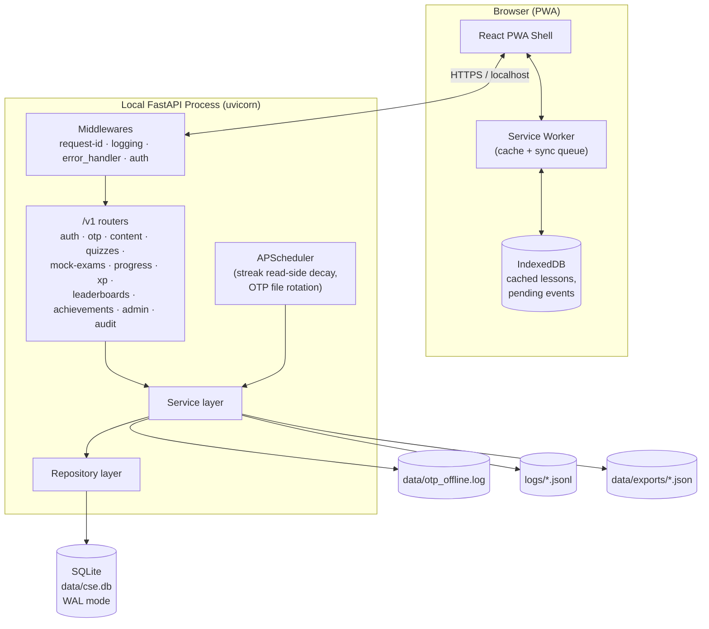
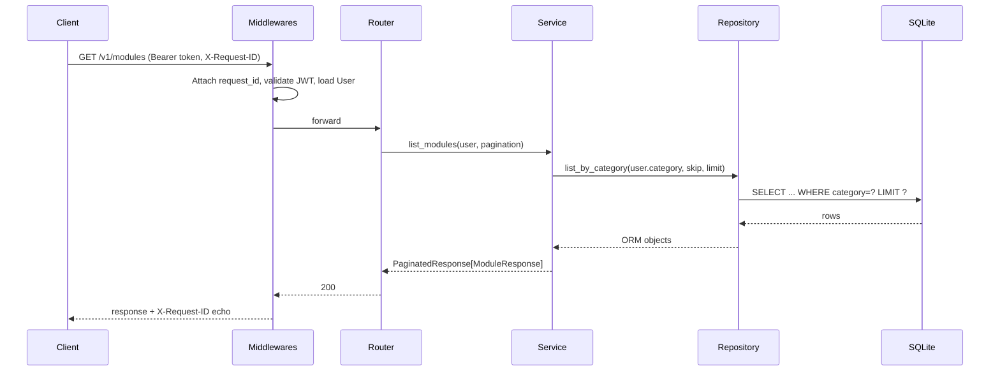
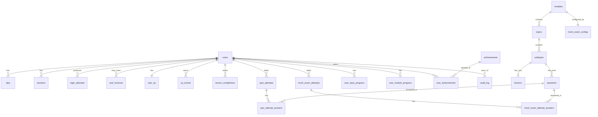
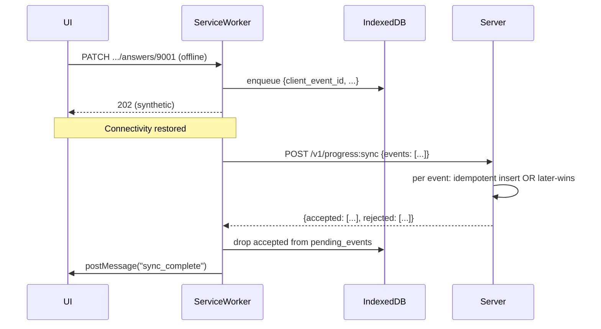
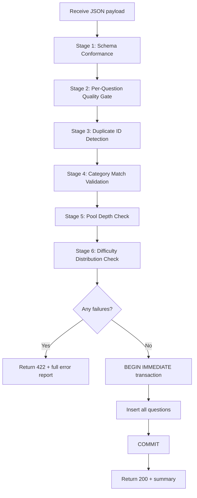

# Design Document

## Overview

The CSE Reviewer System is a locally-installed learning platform delivered as a FastAPI server plus a PWA browser shell. The runtime is a single OS process (uvicorn) backed by an embedded SQLite database, served on `localhost`. The browser-side PWA caches lesson content and queues progress events for later sync, so practice study works offline.

This design is scoped to the architecture, data model, key algorithms, API surface, and correctness properties for the requirements in `requirements.md` (Reqs 1–24).

### MVP vs Phase 2 boundary

Per `requirements.md` Open Question 2, the MVP slice excludes:

- Email-based OTP delivery (replaced with offline-file delivery per Req 2.8 in MVP)
- 165-question category-weighted mock exam (MVP uses a single 50-question mock; full 165 is Phase 2)
- Cross-category preview flag (Req 5.4 — Phase 2)
- Offline mock-exam attempts (Req 20.4 — Phase 2)
- Dark mode toggle (Req 23.6 — Phase 2)
- Achievement set beyond `FIRST_LESSON`, `STREAK_7_DAYS`, `LEVEL_10` (full set is Phase 2)
- Multi-window leaderboards (MVP ships global only; weekly/monthly = Phase 2)

Each component below is tagged `[MVP]` or `[Phase 2]`. Phase 2 components are still designed up-front so the data model and routing surface do not need to be reshaped later.

### Stack decision and explicit deviation from original brief

The original brief requested **Node.js + Express + JSON files**. The workspace steering files (`code-conventions.md`, `api-standard.md`, `testing-standards.md`, `security-policy.md`) mandate **Python + FastAPI + SQLAlchemy + Pydantic**. This design follows the workspace steering. Concrete consequences if the user reverts to the Node/JSON brief:

| Requirement | Why JSON files fail | What this design uses instead |
|---|---|---|
| Req 14.1 — answer SHALL be persisted before responding under concurrent writers | JSON file writes are not atomic across processes; concurrent `PATCH` of an attempt corrupts the file. SQLite uses a write-ahead log and per-row locking. | SQLite WAL mode + single transaction per request |
| Req 16.4 — import SHALL reject duplicate question ids; Req 24.2/24.3 — import SHALL validate referential integrity, no partial commit | JSON has no referential integrity, no foreign keys, no transactional rollback. Implementing this on JSON means reimplementing a relational engine. | SQLAlchemy FK constraints + SQLite `BEGIN IMMEDIATE`/`ROLLBACK` |
| Req 24.1 — single-artifact export | Possible on either, but inverse (24.2) is the blocker. | JSON export of normalized tables; import re-validates FKs in a single tx |
| Req 22.1/22.2/22.3 — p95 budgets at 50 concurrent sessions | JSON-file readers serialize on file lock; 50 concurrent reads stall. | SQLite WAL allows concurrent readers + single writer |
| Req 12.1–12.3 — windowed XP sums for leaderboards | Requires aggregating across all users by date range. JSON forces full scan + in-memory sum on every request. | Indexed `xp_events` ledger; SQL `SUM ... GROUP BY user_id` over a date range |

If the user overrides this and insists on JSON, the deviations to call out are: (a) Req 14.1 must drop "before responding" or accept data loss under concurrency, (b) Req 16.4 / 24.2 / 24.3 must drop transactional guarantees, and (c) Req 22.3 (50 concurrent) must be reduced.

### "AI-powered" working assumption

Per Open Question 3: the question bank is authored offline (not in this spec's scope) and served deterministically from a pre-built bank. No LLM is invoked at request time. The runtime randomization is `secrets.SystemRandom`-based sampling, not generation.

---

## Architecture

### High-level deployment topology



### Request flow (typical authenticated read)



### Components and Interfaces

The system is organized into feature slices under `app/features/`, each owning its own model, schema, repository, service, and router per `code-conventions.md`. Shared infrastructure is under `app/common/` and `app/infrastructure/`.

| Slice | Phase | Responsibility (mapped requirements) |
|---|---|---|
| `auth` | MVP | Signup, login, logout, password reset orchestration, session token issuance, lockout (Req 1, 3, 4) |
| `otp` | MVP | OTP issuance, verification, rate limits, offline-file delivery (Req 2, 4) |
| `users` | MVP | User ORM model + admin user list/ban/delete (Req 15) |
| `content` | MVP | Modules, topics, subtopics, lessons, questions; serving + admin edits; quality gates (Req 5, 6, 16, 18) |
| `quizzes` | MVP | Subtopic/topic/module quiz assembly, attempt lifecycle, grading, prerequisite checks (Req 7, 8, 9) |
| `mock_exams` | MVP (50q) / Phase 2 (165q) | Mock-exam config, assembly, server-side timer, anti-cheat, in-progress guard (Req 10, 19) |
| `progress` | MVP | Lesson completion, attempt persistence, resume snapshot, offline-sync ingestion (Req 6.2, 14, 20.3) |
| `xp` | MVP | XP event ledger, level computation, streak update, audit-correction (Req 11) |
| `leaderboards` | MVP (global) / Phase 2 (weekly/monthly) | Windowed XP sums, ranked listing (Req 12) |
| `achievements` | MVP (subset) / Phase 2 (full set) | Criterion evaluation hook, granting, deduping (Req 13) |
| `announcements` | Phase 2 | Admin announcements, audience filter, display until expiry (Req 17.4) |
| `admin` | MVP | Analytics aggregation, content edit orchestration, export/import, mock-attempt reset (Req 16, 17, 24) |
| `audit` | MVP | Append-only audit log writer + admin-read-only viewer (Req 15.5, 21) |

### Folder structure

Per `code-conventions.md` each feature directory contains exactly the five named files. Adding helpers requires a sub-folder (e.g., `app/features/mock_exams/algorithms/` for the assembler) so the top-level signature stays uniform.

```
app/
├── main.py
├── common/
│   ├── deps.py                       # get_db, get_current_user, require_admin, require_no_active_mock
│   ├── schemas/
│   │   ├── request.py                # PaginationParams
│   │   └── response.py               # PaginatedResponse[T], ErrorResponse
│   └── middlewares/
│       ├── error_handler.py          # global 500 + ErrorResponse envelope
│       ├── logging.py                # X-Request-ID, redaction, structured JSON log
│       └── auth.py                   # bearer token decode → request.state.user
├── infrastructure/
│   ├── database/
│   │   ├── base.py                   # declarative Base
│   │   ├── session.py                # engine + SessionLocal; SQLite WAL pragma at startup
│   │   └── pragmas.py                # journal_mode=WAL, foreign_keys=ON, synchronous=NORMAL
│   ├── repositories/
│   │   └── base.py                   # BaseRepository[ModelType]
│   ├── external/
│   │   ├── base.py                   # ExternalServiceBase ABC
│   │   ├── smtp_otp_sender.py        # online OTP delivery
│   │   └── offline_otp_writer.py     # writes to data/otp_offline.log (Req 2.8)
│   ├── scheduler/
│   │   └── jobs.py                   # APScheduler: hourly OTP cleanup, daily log rotate
│   └── security/
│       ├── jwt.py                    # encode/decode session tokens (HS256 + JTI)
│       ├── passwords.py              # bcrypt hash/verify, work factor ≥ 10
│       └── rng.py                    # secrets.SystemRandom wrapper
└── features/
    ├── auth/                         # signup, login, logout, password-reset
    ├── otp/                          # issue, verify, rate limit
    ├── users/                        # User model lives here; admin list/ban/delete
    ├── content/
    │   ├── algorithms/quality_gate.py    # Req 18 enforcement
    │   ├── ...
    ├── quizzes/
    │   ├── algorithms/assembly.py        # subtopic/topic/module assemblers
    │   ├── algorithms/grading.py
    │   ├── ...
    ├── mock_exams/
    │   ├── algorithms/category_weighted_assembly.py
    │   ├── algorithms/timer.py           # server-authoritative remaining-time
    │   ├── ...
    ├── progress/
    │   ├── algorithms/sync_resolver.py   # Req 20.3 later-client-timestamp
    │   ├── ...
    ├── xp/
    │   ├── algorithms/level.py           # cumulative_xp → level (Req 11.4)
    │   ├── algorithms/streak.py          # rollover + decay (Req 11.3, 11.6)
    │   ├── ...
    ├── leaderboards/
    │   ├── algorithms/windowing.py       # ISO week / calendar month bounds
    │   ├── ...
    ├── achievements/
    ├── announcements/
    ├── admin/
    │   ├── algorithms/export.py
    │   ├── algorithms/import_validator.py # Req 24.2 referential-integrity precheck
    │   ├── ...
    └── audit/
```

### Background jobs

There are only two scheduled jobs; they are intentionally minimal because most "background" work in this system can be done lazily on read.

| Job | Cadence | Purpose | Req |
|---|---|---|---|
| OTP record cleanup | Hourly | Hard-delete OTP rows expired > 24h ago to keep the table small | Req 2.1 (5-min expiry) |
| Offline OTP log rotation | Daily | Rotate `data/otp_offline.log` and gzip yesterday's | Req 2.8 |

Streak rollover (Req 11.6) is computed lazily on every read of XP state, not by a job. This avoids drift across timezones and removes the need to schedule per-user.

---

## Data Models

The schema is normalized 3NF with denormalized scoping columns on `questions` (`topic_id`, `module_id`, `category`) so quiz assembly does not need to join four tables on the hot path (Req 22.2).

### Entity-relationship diagram



### Table specifications

Listed in dependency order. Every table inherits `created_at` / `updated_at` per `code-conventions.md`.

#### `users`
| Column | Type | Notes |
|---|---|---|
| `id` | INTEGER PK | |
| `email` | TEXT UNIQUE NOT NULL | citext-equivalent: stored lowercased |
| `display_name` | TEXT NOT NULL | |
| `age` | INTEGER NOT NULL | CHECK 15 ≤ age ≤ 100 (Req 1.4) |
| `category` | TEXT NOT NULL | CHECK in (`PROFESSIONAL`, `SUB_PROFESSIONAL`) (Req 1.5) |
| `role` | TEXT NOT NULL DEFAULT `LEARNER` | CHECK in (`LEARNER`, `ADMIN`) |
| `account_state` | TEXT NOT NULL DEFAULT `UNVERIFIED` | CHECK in (`UNVERIFIED`, `VERIFIED`) |
| `is_banned` | BOOLEAN NOT NULL DEFAULT 0 | Req 15.3 |
| `tz_name` | TEXT NOT NULL DEFAULT `UTC` | IANA name; required for streak (Req 11.3) |
| `password_hash` | TEXT NOT NULL | bcrypt cost ≥ 10 (Req 1.6) |
| `cross_category_preview` | BOOLEAN NOT NULL DEFAULT 0 | Phase 2 (Req 5.4) |

Indexes: `email` (unique), `(role, is_banned)` for admin filters.

#### `sessions` (JWT denylist + audit trail)
| Column | Type | Notes |
|---|---|---|
| `jti` | TEXT PK | UUIDv4; embedded in JWT |
| `user_id` | FK users | |
| `issued_at` | DATETIME NOT NULL | |
| `expires_at` | DATETIME NOT NULL | issued_at + 24h (Req 3.1) |
| `revoked_at` | DATETIME NULL | non-null = logged out / password reset (Req 3.4, 4.4) |

JWT is HS256, claims: `sub=user_id`, `jti`, `iat`, `exp`. Auth middleware decodes and rejects if `revoked_at` is non-null.

#### `login_attempts` and `user_lockouts`
- `login_attempts(user_id, attempted_at, success)` — rolling-window counter for Req 3.3 (5 failures in 15 min → lock 15 min from latest failure).
- `user_lockouts(user_id PK, locked_until)` — flat record so the auth check is a single point lookup. Updated when login_attempts crosses threshold.

Index: `login_attempts(user_id, attempted_at)`.

#### `otps`
| Column | Type | Notes |
|---|---|---|
| `id` | INTEGER PK | |
| `user_id` | FK users | |
| `purpose` | TEXT NOT NULL | `VERIFY_EMAIL` \| `PASSWORD_RESET` |
| `code_hash` | TEXT NOT NULL | bcrypt-hashed plaintext (Req 2.3 — never log plaintext per Req 21.3) |
| `expires_at` | DATETIME NOT NULL | issued_at + 5 min (Req 2.1) |
| `used` | BOOLEAN NOT NULL DEFAULT 0 | (Req 2.2) |
| `invalidated` | BOOLEAN NOT NULL DEFAULT 0 | (Req 2.5, 2.7 — 6th wrong verify invalidates) |
| `attempt_count` | INTEGER NOT NULL DEFAULT 0 | (Req 2.7) |

Indexes: `(user_id, purpose, used, invalidated, expires_at)` for the verify-latest query; `(user_id, created_at)` for the issuance rate-limit query (Req 2.6).

#### Content: `modules`, `topics`, `subtopics`, `lessons`, `questions`
| Table | Key columns |
|---|---|
| `modules` | `id`, `category` (CHECK), `slug` UNIQUE, `title`, `order_index`, `is_published` |
| `topics` | `id`, `module_id` FK, `slug`, `title`, `order_index`, UNIQUE(`module_id`, `slug`) |
| `subtopics` | `id`, `topic_id` FK, `slug`, `title`, `order_index`, UNIQUE(`topic_id`, `slug`) |
| `lessons` | `id`, `subtopic_id` FK UNIQUE, `content_json` (JSON; sections enumerated below), `status` in (`DRAFT`, `PUBLISHED`, `INCOMPLETE`) |
| `questions` | `id`, `subtopic_id` FK, `topic_id` (denorm), `module_id` (denorm), `category` (denorm), `level_scope` in (`SUBTOPIC`, `TOPIC`, `MODULE`), `stem`, `options` JSON, `correct_answer` TEXT, `explanation`, `difficulty` in (`EASY`, `MEDIUM`, `HARD`), `qtype` in (`MULTIPLE_CHOICE`, `IDENTIFICATION`, `LOGICAL_REASONING`, `READING_COMPREHENSION`, `PROBLEM_SOLVING`), `is_active` BOOLEAN |

Lesson `content_json` schema (validated by Pydantic before write to satisfy Req 6.3 and 6.4):
```json
{
  "explanations": [{"heading": "...", "body": "..."}],   // ≥ 1 required
  "worked_examples": [{"title": "...", "body": "..."}],  // ≥ 1 required
  "key_takeaways": ["..."],                              // non-empty list
  "summary": "..."                                       // non-empty
}
```
On admin write, `LessonContent` Pydantic model enforces these. If validation fails, `status=INCOMPLETE` and the lesson is hidden from learners (Req 6.4).

Indexes critical for assembly p95 (Req 22.2):
- `questions(subtopic_id, is_active)`
- `questions(topic_id, is_active, level_scope)`
- `questions(module_id, is_active, level_scope)`
- `questions(category, is_active)` for mock-exam scope

#### `mock_exam_configs`
One row per category:
| Column | Notes |
|---|---|
| `category` | PK |
| `total_questions` | 165 (Phase 2) / 50 (MVP) |
| `weights_json` | `{module_id: count}`, must sum to `total_questions` (Req 10.1, 10.2) |
| `time_limit_minutes` | 180 (Req 10.3) |
| `nav_policy` | `LINEAR_NO_REVISIT` \| `FREE_NAV` (Req 19.4) |
| `pass_threshold` | 0.80 (Req 10.5) |

Validated on admin write: weights sum equals total_questions; every module_id exists and matches `category`.

#### Progress and attempts
- `lesson_completions(user_id, lesson_id, completed_at, client_event_id UNIQUE NULLABLE)` — `client_event_id` is the offline-sync idempotency key (Req 20.3). UNIQUE on `(user_id, lesson_id)`.
- `quiz_attempts(id, user_id, scope_level, scope_id, started_at, submitted_at NULL, status, score NULL, max_score, seed, client_event_id UNIQUE NULLABLE)`.
- `quiz_attempt_answers(attempt_id, question_id, ordinal, selected_answer, is_correct, answered_at)`. UNIQUE(`attempt_id`, `question_id`).
- `mock_exam_attempts(id, user_id, category, started_at, submitted_at NULL, submission_mode NULL, status in (IN_PROGRESS, SUBMITTED, AUTO_SUBMITTED), score NULL, max_score, seed, focus_loss_events JSON, nav_policy, time_limit_minutes)`. CHECK: at most one IN_PROGRESS per user (enforced via partial unique index on `(user_id) WHERE status='IN_PROGRESS'`) (Req 10.8).
- `mock_exam_attempt_answers(attempt_id, question_id, ordinal, selected_answer, is_correct, answered_at, finalized_at NULL)`. UNIQUE(`attempt_id`, `ordinal`).
- `user_topic_progress(user_id, topic_id, completed_at)` UNIQUE; written when Req 8.5 satisfied.
- `user_module_progress(user_id, module_id, completed_at)` UNIQUE; written when Req 9.4 satisfied.

#### XP, level, streak
- `user_xp(user_id PK, cumulative_xp BIGINT NOT NULL DEFAULT 0, level INTEGER NOT NULL DEFAULT 0, level_reached_at DATETIME NULL, streak_count INTEGER NOT NULL DEFAULT 0, last_activity_at DATETIME NULL, last_streak_day DATE NULL)` — single row per user, updated under `SELECT ... FOR UPDATE`-equivalent (SQLite serializes writers).
- `xp_events(id, user_id, source ENUM, source_ref_id NULL, amount INTEGER NOT NULL CHECK >= 0 OR source='ADMIN_CORRECTION', occurred_at DATETIME NOT NULL, client_event_id UNIQUE NULLABLE)` — append-only ledger. `source` ∈ `LESSON_FIRST_COMPLETE`, `QUIZ_PASS`, `QUIZ_PERFECT`, `MOCK_PASS`, `STREAK_DAY`, `ADMIN_CORRECTION`. `cumulative_xp` is **not** trusted as authoritative — it is a denormalized cache of `SUM(xp_events.amount)` and is reconcilable.

Index: `xp_events(user_id, occurred_at DESC)` for windowed sums (Req 12.2, 12.3).

#### Achievements
- `achievements(id TEXT PK, title, description, criterion_kind, criterion_value JSON)` — seed data; criteria evaluated in code, this row is the metadata.
- `user_achievements(user_id, achievement_id, granted_at, source_xp_event_id NULL)` UNIQUE(`user_id`, `achievement_id`) (Req 13.3).

#### Announcements (Phase 2)
- `announcements(id, title, body, audience_filter JSON, expires_at, created_by, created_at)`. `audience_filter` matches by `category` and/or `role`.
- `announcement_dismissals(user_id, announcement_id, seen_at)` so a user only sees once per session bootstrap.

#### Audit log
- `audit_log(id, actor_id NULL, action TEXT, target_kind TEXT, target_id TEXT NULL, payload_json JSON, request_id TEXT, occurred_at)` — append-only, no UPDATE/DELETE permitted from application layer. Req 15.5, 21.1, 21.2.

#### Content question rejection log
- `question_rejection_log(question_id, rule, rejected_at)` — Req 18.4.

### Why this is SQLite, not Postgres

SQLite satisfies Req 14.1, 16.4, 22.3, 24.2, 24.3 inside a single OS process, requires no separate service, and matches "local install" in the brief. WAL mode allows ~50 concurrent readers + 1 writer comfortably on commodity hardware, satisfying Req 22.3. If the user later wants a multi-machine deployment, the SQLAlchemy ORM ports to Postgres without code change (only the engine URL and the WAL pragma block change).

---

## API Contract

### Conventions (from `api-standard.md`)

- All endpoints under `/v1/`. Routers carry their own `prefix`; mounting under `/v1` happens once in `main.py`.
- Plural-noun, kebab-case URLs.
- `GET` list / get-one (200), `POST` create (201), `PATCH` update (200), `DELETE` (204).
- Pagination via `PaginationParams` (`skip>=0`, `1<=limit<=100`); responses use `PaginatedResponse[T]` with `items, total, skip, limit` (Req 15.2).
- Errors envelope: `{"error": {"message": str, "code": str}}`. The global handler in `app/common/middlewares/error_handler.py` converts unhandled exceptions to 500 without stack traces.
- `X-Request-ID` echoed on every response (Req 21.4).
- Auth via `Authorization: Bearer <jwt>`; required dependency `get_current_user`; admin-only routes additionally depend on `require_admin`.
- 401 on missing/invalid token, 403 on authorized-but-forbidden (banned, wrong role, wrong category, exam-in-progress) — never 404 to hide existence (per `security-policy.md`).

### Resource map

```
# auth
POST   /v1/auth/signups                          → 201 (Req 1)
POST   /v1/auth/email-verifications              → 200 (Req 2.2)  body: {email, code}
POST   /v1/auth/email-verifications:resend       → 200 (Req 2.5)
POST   /v1/auth/sessions                         → 201 (Req 3.1)  login
DELETE /v1/auth/sessions/me                      → 204 (Req 3.4)  logout
POST   /v1/auth/password-reset-requests          → 200 (Req 4.1, 4.2 — same response shape regardless)
POST   /v1/auth/password-resets                  → 200 (Req 4.3)  body: {email, code, new_password}

# self
GET    /v1/users/me                              → 200
PATCH  /v1/users/me                              → 200 (display_name, tz_name)

# content (learner)
GET    /v1/modules?skip=&limit=                  → 200 (Req 5.1, 5.2 — filtered by category)
GET    /v1/modules/{id}                          → 200 (Req 5.3 — 403 if wrong category)
GET    /v1/modules/{id}/topics                   → 200
GET    /v1/topics/{id}/subtopics                 → 200
GET    /v1/subtopics/{id}/lesson                 → 200 (Req 6.4 — 404 only if INCOMPLETE)
POST   /v1/subtopics/{id}/lesson:complete        → 201 (Req 6.2)  body: {client_event_id, completed_at}

# quizzes
POST   /v1/subtopics/{id}/quiz-attempts          → 201 (Req 7.1)
POST   /v1/topics/{id}/quiz-attempts             → 201 (Req 8.1, 8.2)
POST   /v1/modules/{id}/quiz-attempts            → 201 (Req 9.1, 9.2)
GET    /v1/quiz-attempts/{id}                    → 200  in-progress shape (no answers/explanations)
PATCH  /v1/quiz-attempts/{id}/answers/{qid}      → 200  set selected; never reveals correctness mid-attempt (Req 7.4)
POST   /v1/quiz-attempts/{id}:submit             → 200 (Req 7.5 — full feedback)

# mock exams
POST   /v1/mock-exams/attempts                   → 201 (Req 10.1, 10.2)
GET    /v1/mock-exams/attempts/{id}              → 200 + server-computed remaining_seconds (Req 19.3)
PATCH  /v1/mock-exams/attempts/{id}/answers/{qid} → 200
POST   /v1/mock-exams/attempts/{id}:report-focus-loss → 204 (Req 19.2)
POST   /v1/mock-exams/attempts/{id}:submit       → 200 (Req 10.5)

# progress
GET    /v1/progress/snapshot                     → 200 (Req 14.2 — resume payload)
POST   /v1/progress:sync                         → 200 (Req 20.3 — batch ingestion)

# xp / leaderboards / achievements
GET    /v1/xp/me                                 → 200 (cumulative, level, streak)
GET    /v1/leaderboards/global?skip=&limit=      → 200 (Req 12.1)
GET    /v1/leaderboards/weekly                   → 200 (Req 12.2)  [Phase 2]
GET    /v1/leaderboards/monthly                  → 200 (Req 12.3)  [Phase 2]
GET    /v1/achievements/me                       → 200

# admin
GET    /v1/admin/users                           → 200 (Req 15.2)
PATCH  /v1/admin/users/{id}                      → 200 (ban toggle, role) (Req 15.3)
DELETE /v1/admin/users/{id}                      → 204 (Req 15.4)
POST   /v1/admin/modules                         → 201 (Req 16.1)
PATCH  /v1/admin/modules/{id}                    → 200
DELETE /v1/admin/modules/{id}?force=             → 204 / 409 (Req 16.3)
# (parallel for topics, subtopics, lessons, questions)
POST   /v1/admin/questions:bulk-import           → 200 (Req 16.4)
DELETE /v1/admin/users/{id}/mock-exam-attempts   → 204 (Req 17.1)
GET    /v1/admin/analytics                       → 200 (Req 17.2)
POST   /v1/admin/exports                         → 201 (Req 17.3, 24.1)
POST   /v1/admin/imports                         → 200 / 422 (Req 24.2, 24.3)
POST   /v1/admin/announcements                   → 201 (Req 17.4)  [Phase 2]

# audit
GET    /v1/admin/audit-log?skip=&limit=          → 200 (Req 21)

# health
GET    /health                                   → 200
```

### Request/response examples (representative; full Pydantic schemas in code)

`POST /v1/subtopics/{id}/quiz-attempts` response (in-progress shape — no correct answers):
```json
{
  "attempt_id": 123,
  "scope_level": "SUBTOPIC",
  "scope_id": 17,
  "started_at": "2025-...Z",
  "questions": [
    {"id": 9001, "ordinal": 1, "stem": "...", "qtype": "MULTIPLE_CHOICE", "options": ["A","B","C","D"]}
  ],
  "total_questions": 20
}
```

`POST /v1/mock-exams/attempts/{id}:submit` response:
```json
{
  "attempt_id": 555,
  "submission_mode": "MANUAL",
  "score": 134,
  "max_score": 165,
  "percentage": 0.812,
  "passed": true,
  "per_module_breakdown": [{"module_id": 1, "title": "...", "score": 22, "max": 25, "pct": 0.88}],
  "weakness_summary": [{"module_id": 7, "pct": 0.40}, ...],
  "questions": [{"id": 9001, "selected": "B", "correct": "C", "is_correct": false, "explanation": "..."}]
}
```

---

## Key Algorithms

### A1. Mock-exam category-weighted assembly (Req 10.1, 10.2, 18, 22.2)

```
def assemble_mock_exam(category, mock_exam_config) -> list[Question]:
    weights = mock_exam_config.weights_json   # {module_id: count}
    assert sum(weights.values()) == mock_exam_config.total_questions    # validated at config write
    seed = secrets.randbits(64)
    rng = random.Random(seed)
    selected = []
    for module_id, count in weights.items():
        pool = QuestionRepo.list_active_passing_quality_gate(
            module_id=module_id, category=category
        )
        if len(pool) < count:
            raise HTTPException(409, "insufficient_question_pool")
        chosen = rng.sample(pool, count)
        selected.extend(chosen)
    rng.shuffle(selected)            # final order is randomized across modules
    for q in selected:
        if q.qtype == "MULTIPLE_CHOICE":
            q._option_order = list(range(len(q.options)))
            rng.shuffle(q._option_order)        # per-question option shuffle (Req 7.3 applied to mock)
    return selected, seed
```

`seed` is persisted on `mock_exam_attempts.seed` so the exam is reproducible from the audit record.

### A2. Subtopic / topic / module quiz assembly (Req 7.1, 8.2, 9.2, 7.3)

Identical shape to A1 but single pool, no weights. Each pool query filters by `level_scope` so the subtopic 20 / topic 50 / module 100 pools can be authored independently (resolves Open Question 4).

### A3. XP-event-based level computation (Req 11.4, 11.7)

`cumulative_xp(user_id) = SUM(xp_events.amount where user_id=?)` — denormalized into `user_xp.cumulative_xp` after every insert into `xp_events`. Inserts and the cache update happen in one transaction. The level mapping:

```
def level_of(cumulative_xp: int) -> int:
    # Level N requires 100 * N * (N+1) / 2 cumulative XP. Find largest N satisfying it.
    # 50 * N * (N+1) <= cumulative_xp  ⇒  N <= (-1 + sqrt(1 + 4*cumulative_xp/50)) / 2
    if cumulative_xp < 100:
        return 0
    n = int((-1 + math.sqrt(1 + 4 * cumulative_xp / 50)) / 2)
    while 50 * n * (n + 1) > cumulative_xp:
        n -= 1
    while 50 * (n + 1) * (n + 2) <= cumulative_xp:
        n += 1
    return n
```

The `while` corrections handle floating-point edge cases. This makes level computation a pure function of cumulative XP. `level_reached_at` is set when the computed level moves above the previous stored level.

XP awards are constrained at the service layer to the events listed in Req 11.1. The `xp_events.source` enum is the closed set; an attempt to insert any other source raises a CHECK violation. Decrements only via `ADMIN_CORRECTION` (Req 11.7).

### A4. Streak rollover (Req 11.3, 11.6)

Streak is computed-on-write and decayed-on-read:

```
def on_qualifying_activity(user, now_utc):
    z = ZoneInfo(user.tz_name)
    today = now_utc.astimezone(z).date()
    state = user_xp_repo.get(user.id)
    award_25 = False

    if state.last_streak_day is None:
        state.streak_count = 1
        award_25 = True
    elif today == state.last_streak_day:
        pass
    elif today == state.last_streak_day + timedelta(days=1) and \
         (now_utc - state.last_activity_at) <= timedelta(hours=36):
        state.streak_count += 1
        award_25 = True
    else:
        state.streak_count = 1   # gap > 1 day or > 36h ⇒ fresh start
        award_25 = True

    state.last_activity_at = now_utc
    state.last_streak_day = today
    if award_25:
        xp_service.award(user.id, source="STREAK_DAY", amount=25)
    user_xp_repo.upsert(state)

def streak_for_read(user, now_utc):
    state = user_xp_repo.get(user.id)
    if state.last_activity_at and (now_utc - state.last_activity_at) > timedelta(hours=36):
        return 0
    return state.streak_count
```

Reads compute the decay but only persist `0` next time a write happens (avoids write amplification on every GET).

### A5. Leaderboard windowing (Req 12.1, 12.2, 12.3, 12.4, 12.5)

```
# global
SELECT u.id, u.display_name, ux.level, ux.cumulative_xp, u.category
FROM users u JOIN user_xp ux ON ux.user_id = u.id
WHERE u.account_state='VERIFIED' AND u.is_banned=0
ORDER BY ux.cumulative_xp DESC, ux.level_reached_at ASC
LIMIT 100

# weekly  (current ISO week in UTC: Monday 00:00 to Sunday 23:59:59.999999)
SELECT u.id, u.display_name, ux.level, COALESCE(SUM(e.amount), 0) AS xp_window, u.category
FROM users u
JOIN user_xp ux ON ux.user_id = u.id
LEFT JOIN xp_events e ON e.user_id = u.id
  AND e.occurred_at >= :iso_week_start_utc AND e.occurred_at <= :iso_week_end_utc
WHERE u.account_state='VERIFIED' AND u.is_banned=0
GROUP BY u.id
ORDER BY xp_window DESC, ux.level_reached_at ASC
LIMIT 100
```

ISO week bounds in code: take `now.astimezone(UTC).isocalendar()` to get `(year, week, weekday)`, then `start = datetime.combine(date.fromisocalendar(year, week, 1), time.min, UTC)` and `end = start + timedelta(days=7) - 1 microsecond`. Monthly is `(year, month, 1)` to next month start − 1µs.

### A6. OTP issuance and verification (Req 2.1, 2.2, 2.3, 2.5, 2.6, 2.7, 2.8)

Issuance:
```
def issue(user_id, purpose, mode):
    rate = otp_repo.count_issuances_in_last_60min(user_id)
    if rate >= 5: raise HTTPException(429, "otp_rate_limited")
    otp_repo.invalidate_unused_for(user_id, purpose)              # Req 2.5
    code = f"{secrets.randbelow(1_000_000):06d}"
    otp_repo.create(user_id, purpose, code_hash=bcrypt(code),
                    expires_at=now+5min)
    if mode == "online":
        smtp_sender.send(user.email, code)
    if mode in ("offline", "both"):                                # Req 2.8
        offline_otp_writer.append(user.email, code, purpose, now)
```

Verification:
```
def verify(email, code, purpose):
    user = users_repo.get_by_email(email)
    if not user: raise HTTPException(400, "otp_invalid_or_expired")  # Req 2.3 generic
    otp = otp_repo.get_latest_active(user_id=user.id, purpose=purpose)
    if not otp:                              raise HTTPException(400, "otp_invalid_or_expired")
    if otp.expires_at < now:                 raise HTTPException(400, "otp_invalid_or_expired")
    otp.attempt_count += 1
    if otp.attempt_count >= 6:               # Req 2.7
        otp.invalidated = True
        otp_repo.update(otp)
        raise HTTPException(400, "otp_invalid_or_expired")
    if not bcrypt.verify(code, otp.code_hash):
        otp_repo.update(otp)                                       # save attempt count
        raise HTTPException(400, "otp_invalid_or_expired")
    otp.used = True
    otp_repo.update(otp)
    return user
```

### A7. Mock-exam anti-cheat (Req 19.1, 19.2, 19.3, 19.4, 10.3, 10.8)

- **Server-authoritative timer (19.3, 10.3):** every read or write on the attempt computes `remaining = time_limit - (now - started_at)`. If `remaining <= 0` and `status==IN_PROGRESS`, the service auto-submits before processing the request and returns the result with `submission_mode=AUTO_SUBMIT`. The client never sets `remaining`.
- **In-progress guard (19.1):** middleware `require_no_active_mock` is applied to all `/v1/subtopics/**`, `/v1/topics/**`, `/v1/modules/**`, `/v1/quiz-attempts/**` routes. It checks for an `IN_PROGRESS` mock-exam attempt for the current user and returns 409 `exam_in_progress` if present.
- **Single-attempt enforcement (10.8):** partial unique index on `mock_exam_attempts(user_id) WHERE status='IN_PROGRESS'` makes a duplicate attempt impossible at the storage layer.
- **Focus-loss recording (19.2):** `POST :report-focus-loss` appends `{at, kind}` to `focus_loss_events` JSON. The endpoint **does not** modify `started_at` or remaining time.
- **Revisit policy (19.4):** if `nav_policy == LINEAR_NO_REVISIT`, `PATCH .../answers/{qid}` is rejected with 409 if the answer row already has `finalized_at` set. `finalized_at` is set when the next ordinal is opened.

### A8. Offline sync conflict resolution (Req 14, 20.3)

Sync request shape:
```json
{
  "events": [
    {
      "client_event_id": "uuid",
      "kind": "LESSON_COMPLETION" | "QUIZ_SUBMISSION" | "XP_EVENT",
      "client_timestamp": "2025-...Z",
      "payload": { ... }
    }
  ]
}
```

Resolver, per event:

```
existing = repo.get_by_client_event_id(event.client_event_id)
if existing is None:
    repo.insert(event)                                  # idempotent first-write
elif event.client_timestamp > existing.client_timestamp:
    repo.replace(existing.id, event)                    # Req 20.3 later-wins
else:
    pass                                                # earlier or equal → discard
```

The `client_event_id` is generated by the PWA when the action is taken (online or offline), so the same action sent twice — once optimistically online, once after reconnect — collapses on insert.

### A9. Question quality gate (Req 18.1–18.4)

Centralized in `app/features/content/algorithms/quality_gate.py`. Applied as a SQL filter in every assembly query (so a bad question cannot leak into a quiz):

```
is_active = TRUE
AND length(stem) > 0
AND length(explanation) > 0
AND difficulty IN ('EASY','MEDIUM','HARD')
AND qtype IN (...)
AND (qtype != 'MULTIPLE_CHOICE' OR (json_array_length(options) BETWEEN 2 AND 6))
AND (qtype NOT IN ('MULTIPLE_CHOICE','IDENTIFICATION') OR (correct_answer IN (json_each.value FROM options)))
```

The exact predicate is encapsulated in a `valid_question_filter()` SQLAlchemy expression used by every assembler. On admin write, the same predicate is checked and the question is rejected (Req 16.2). When a previously-valid question becomes invalid, it is logged into `question_rejection_log` and excluded from assembly — but is **not** auto-deleted.

### A10. Import referential-integrity precheck (Req 24.2, 24.3, 16.4)

```
with engine.begin() as tx:    # BEGIN IMMEDIATE
    staging = parse_artifact(file)
    errors = []
    seen_q_ids = set()
    for q in staging.questions:
        if q.id in seen_q_ids: errors.append(("DUPLICATE_QUESTION", q.id))   # Req 16.4
        seen_q_ids.add(q.id)
        if q.subtopic_id not in staging.subtopic_ids: errors.append(...)
    # ... full FK closure check on all referenced ids ...
    if errors:
        tx.rollback()
        raise HTTPException(422, detail={"failed_references": errors})
    apply_inserts_and_updates(tx, staging)
    tx.commit()
```

No partial state on rollback — this is the user-visible reason this design uses SQLite over JSON files.

---

## PWA + Offline Sync

### Service worker strategy

- **Static assets** (JS, CSS, fonts): `cache-first` with versioned URLs; service worker pre-caches the app shell during install.
- **API GETs for content** (`/v1/modules`, `/v1/topics/*`, `/v1/subtopics/*/lesson`, `/v1/subtopics/*/quiz-pool` for offline-eligible quizzes): `stale-while-revalidate`. Stale response is returned immediately, network update populates IndexedDB for next time.
- **API GETs for state** (`/v1/users/me`, `/v1/progress/snapshot`, `/v1/leaderboards/*`): `network-only` when online; **404→cached fallback only for `/v1/progress/snapshot`** so resume still works offline.
- **API mutations**: `network-only` when online. On offline, the SW responds with a synthetic 202 from a Background Sync queue (see below).

### IndexedDB stores

| Store | Records | Source |
|---|---|---|
| `cached_lessons` | `{id, content_json, fetched_at}` | populated when learner opens a lesson online |
| `cached_subtopic_pools` | `{subtopic_id, questions, fetched_at}` | populated on first opening of subtopic quiz online |
| `pending_events` | `{client_event_id, kind, client_timestamp, payload}` | written by every offline mutation |
| `auth_state` | `{token, expires_at, last_authenticated_at}` | populated on login |

### Auth gating offline (Req 20.2)

Offline access is permitted only if `auth_state.last_authenticated_at` is within 24 hours. Otherwise the offline UI prompts to reconnect.

### Background Sync flow



### Conflict resolution rule

Server treats every event as independently resolvable per A8. The `client_event_id` is the unique key. There is no cross-event causality enforcement (a quiz submission referencing a lesson completion only requires the lesson completion to exist when the quiz starts; the *server* checks that on sync — if the lesson completion is missing, the quiz submission is rejected with `prerequisite_missing` and the client can retry once the prior event syncs).

### Mock exams and offline (Req 20.4 — Phase 2)

Mock exams are blocked offline because the server-authoritative timer (Req 19.3) requires the server. Attempting `POST /v1/mock-exams/attempts` offline returns synthetic `409 mock_exam_offline_unavailable` from the SW, and the UI prevents starting it.

---

## Security Model

Per `security-policy.md`:

- **Input validation**: every router accepts a Pydantic schema (`SignupRequest`, `LoginRequest`, `OTPVerifyRequest`, `QuizAnswerPatch`, etc.). No `dict` / `Any` payloads. Field constraints are enforced declaratively (`Field(min_length=8)`, etc.) and 422 surfaces unmodified.
- **Password rules** (Req 1.3): a custom Pydantic validator on `password` fields enforces ≥ 8 chars, ≥ 1 upper, ≥ 1 lower, ≥ 1 digit, ≥ 1 symbol from the documented set. The 422 detail names the failing rule(s).
- **Password storage** (Req 1.6): `bcrypt` with `rounds >= 10`. Cost is a constant in `app/infrastructure/security/passwords.py`.
- **JWT** (Req 3.1, 3.4, 3.5): HS256, 24-hour expiry, claims `sub, jti, iat, exp`. JTI is checked against `sessions.revoked_at` on every request; revoked JTIs return 401.
- **SQL**: SQLAlchemy ORM only; raw SQL is forbidden (`security-policy.md`). Where a windowed aggregate needs `text()`, all values bind via `bindparams`.
- **Error envelope**: `ErrorResponse` from `app.common.schemas.response`. The global handler in `app/common/middlewares/error_handler.py` is the only path where unhandled exceptions terminate, and it emits a generic 500 — never a stack trace (Req 21.3 logging redaction also lives here).
- **Request correlation** (Req 21.4): `LoggingMiddleware` adds `X-Request-ID` (incoming or generated UUIDv4), binds it into the structured-log context, and echoes it in response headers.
- **Generic auth errors** (Req 2.3, 3.2, 4.2): the same `detail` is returned regardless of which condition failed (account doesn't exist, wrong password, OTP wrong, OTP expired, OTP used) so the API does not become an enumeration oracle.
- **Lockout** (Req 3.3): tracked per-user in `user_lockouts`; lookup is one row before bcrypt verify (so attackers cannot bypass with timing).
- **Audit log** (Req 15.5, 21): `AuditLogger` is a service injected into every admin and auth service. It writes to `audit_log` in the same transaction as the action, so an action and its log entry succeed or fail together.
- **Redaction** (Req 21.3): the structured-log formatter strips fields named `password`, `password_hash`, `code`, `otp_code`, `token`, `authorization` from log records.
- **Banned users** (Req 15.3): `get_current_user` rejects with 403 if `is_banned`. This means a banned user with a still-valid JWT is locked out without revoking each token.

---

## Performance Budgets

Targets from Req 22:
- 22.1: Lesson GET p95 ≤ 300ms
- 22.2: Quiz/mock-exam start p95 ≤ 800ms
- 22.3: 50 concurrent learner sessions

Techniques:

| Hot path | Technique |
|---|---|
| Lesson GET | Single-row `SELECT lessons WHERE subtopic_id=?` on indexed FK; lesson content is small (< 50KB typical) |
| Subtopic quiz start (20q) | One indexed query on `questions(subtopic_id, is_active, level_scope)` with the quality-gate filter; sample in Python from a list ≤ a few hundred |
| Topic quiz start (50q) | Same shape with `topic_id` index |
| Module quiz start (100q) | Same shape with `module_id` index |
| Mock exam start (165q) | Per-module sample loop; pools are pre-filtered by `is_active` and quality-gate predicate; total work is N module queries, each indexed |
| Leaderboard global | Indexed `ORDER BY cumulative_xp DESC` with covering index `(cumulative_xp DESC, level_reached_at ASC, user_id)` |
| Leaderboard weekly/monthly | `xp_events(user_id, occurred_at DESC)` index; `GROUP BY user_id` aggregate with date-range filter |
| Module list | In-process LRU cache (`functools.lru_cache` invalidated on admin write) — module/topic/subtopic data is small and rarely changes |

SQLite tuning at startup (in `app/infrastructure/database/pragmas.py`):
- `PRAGMA journal_mode=WAL`
- `PRAGMA synchronous=NORMAL`
- `PRAGMA foreign_keys=ON` (FK enforcement matters for Req 16.3, 24.2)
- `PRAGMA temp_store=MEMORY`
- `PRAGMA mmap_size=268435456` (256MB)

No external cache (Redis/Memcached). Adding one would violate "local install" and is unnecessary at this scale.


---

## Correctness Properties

*A property is a characteristic or behavior that should hold true across all valid executions of a system — essentially, a formal statement about what the system should do. Properties serve as the bridge between human-readable specifications and machine-verifiable correctness guarantees.*

The properties below were derived from prework analysis of every acceptance criterion (1.1 – 24.3). Criteria classified as `EXAMPLE`, `SMOKE`, `INTEGRATION`, or `NOT_TESTABLE_AS_PROPERTY` (e.g., 22.1–22.3 perf budgets, 23.2–23.5 visual/a11y) are listed in the Testing Strategy section and are not in this list. Properties that share a quantifier and an invariant have been consolidated (per the Property Reflection step) — for example, "exactly 20 / 50 / 100 / 165 questions" collapses to a single family with parametrized counts.

### Property 1: Password rule completeness

*For any* string `s`, the password validator accepts `s` if and only if `len(s) >= 8` AND `s` contains at least one uppercase letter AND at least one lowercase letter AND at least one digit AND at least one symbol from the documented set.

**Validates: Requirements 1.3**

### Property 2: Age range bounds

*For any* integer `n`, the signup age validator accepts `n` if and only if `15 <= n <= 100`.

**Validates: Requirements 1.4**

### Property 3: OTP issuance shape

*For any* OTP issuance (any user, any purpose), the resulting record satisfies: code matches the regex `^\d{6}$`, `expires_at == issued_at + 5 minutes` (within clock skew tolerance), `used == false`, `invalidated == false`, `attempt_count == 0`, and `code_hash` does not equal the plaintext code.

**Validates: Requirements 2.1**

### Property 4: OTP single-use and generic failure

*For any* user `u` and any OTP code `c`, after `verify(u, c)` succeeds once, every subsequent `verify(u, c)` returns the canonical generic `otp_invalid_or_expired` error and does not transition account state. Equivalently: an OTP can be consumed at most once. Failure responses for (wrong code, expired, used, invalidated) are byte-equal in `error.code` and `error.message`.

**Validates: Requirements 2.2, 2.3**

### Property 5: At-most-one active OTP per (user, purpose)

*For any* sequence of OTP issuance and time-passing events for a single (user, purpose) pair, after every event the count of OTP records satisfying `(used==false AND invalidated==false AND expires_at>now)` is at most 1.

**Validates: Requirements 2.5**

### Property 6: OTP issuance rate limit

*For any* timeline of OTP issuance requests for a single user, the `(k+1)`-th issuance within any rolling 60-minute window is rejected when `k >= 5`, and never rejected when `k < 5`.

**Validates: Requirements 2.6**

### Property 7: OTP verification attempt cap

*For any* sequence of `>= 6` failed verification attempts against a single OTP, the OTP becomes `invalidated` on the 6th attempt, and any subsequent verification (even with the correct code) returns the generic failure error.

**Validates: Requirements 2.7**

### Property 8: Session token validity window

*For any* successful login at time `t`, the issued JWT decodes to claims with `iat == t` and `exp == t + 24h` (within clock skew tolerance), `jti` is a fresh UUIDv4 not present in any prior session, and the corresponding row in `sessions` has `revoked_at == NULL`.

**Validates: Requirements 3.1**

### Property 9: Login lockout

*For any* timeline of login attempts against a single user, the user is `temporarily_locked` at time `t` if and only if there exist `>= 5` failed attempts within the 15-minute window ending at the most recent failure preceding `t`, and the lock expires 15 minutes after that most recent failure.

**Validates: Requirements 3.3**

### Property 10: Forgot-password enumeration resistance

*For any* email `e`, the response to `POST /v1/auth/password-reset-requests {email: e}` has byte-equal status code, response body, and (within a defined timing bucket) response time, regardless of whether `e` corresponds to an existing account.

**Validates: Requirements 4.2**

### Property 11: Password reset invalidates all sessions

*For any* user `u` and *for any* set of pre-existing `sessions` rows for `u`, after a successful password reset, every session row for `u` has `revoked_at != NULL` and every subsequent request bearing any of those tokens returns 401.

**Validates: Requirements 4.4**

### Property 12: Category isolation

*For any* (user, resource) pair where `resource` is a Module, Topic, Subtopic, Lesson, or Quiz, the request returns 200 if and only if `user.category == resource.category` (or, in Phase 2, `user.cross_category_preview` is true). For mismatches, the response is 403 — never 404.

**Validates: Requirements 5.1, 5.2, 5.3**

### Property 13: Lesson content schema completeness

*For any* `LessonContent` payload, the validator accepts it if and only if it contains `>= 1` explanation section, `>= 1` worked example, a non-empty `key_takeaways` list, and a non-empty `summary` string. Lessons whose `content_json` fails this check are stored with `status=INCOMPLETE` and are excluded from every learner-facing response.

**Validates: Requirements 6.3, 6.4**

### Property 14: Lesson-before-quiz gating

*For any* (user, subtopic) pair, `POST /v1/subtopics/{id}/quiz-attempts` returns success if and only if a `lesson_completions` row exists for that (user, subtopic). Otherwise it returns 409 `lesson_not_completed`.

**Validates: Requirements 6.1**

### Property 15: Question-count exactness in assembly

*For any* assembly request at scope level `S ∈ {SUBTOPIC, TOPIC, MODULE, MOCK}` against a pool that satisfies the required size constraint, the assembled question list has exactly `count(S)` items where `count(SUBTOPIC)=20, count(TOPIC)=50, count(MODULE)=100, count(MOCK)=mock_exam_config.total_questions`. Every item is drawn from the correct scope's pool, every item passes the question-quality filter, and (for mock exams) the per-module count exactly equals `weights_json[module_id]` for every module.

**Validates: Requirements 7.1, 8.2, 9.2, 10.1, 10.2**

### Property 16: Randomization across attempts

*For any* pool `P` with `|P| >= count(S)`, *for any* two distinct seeds `s1, s2`, the assembled lists `assemble(P, s1)` and `assemble(P, s2)` are each a permutation of a `count(S)`-sized subset of `P` and the multiset of question orderings produced over many seeds is non-degenerate (probability of identical ordering across two random seeds is below a negligible threshold). For `MULTIPLE_CHOICE` questions, option order is independently shuffled per attempt instance.

**Validates: Requirements 7.3**

### Property 17: Mid-attempt non-disclosure

*For any* attempt `a` with `status == IN_PROGRESS` and *for any* request to `GET /v1/quiz-attempts/{a.id}` or `GET /v1/mock-exams/attempts/{a.id}` or any answer-PATCH response, the response body contains no field named `is_correct`, `correct_answer`, or `explanation` for any question.

**Validates: Requirements 7.4, 10.4**

### Property 18: Prerequisite gating for higher-scope quizzes

*For any* user `u` and *for any* topic `T`, `POST /v1/topics/{T.id}/quiz-attempts` succeeds if and only if every subtopic-quiz under `T` has been passed at least once by `u`. Symmetric statement holds for module quizzes over their constituent topic quizzes.

**Validates: Requirements 8.1, 9.1**

### Property 19: Level mapping correctness and monotonicity

*For any* non-negative integer `xp`, `level_of(xp) == max{N ∈ ℕ : 50 * N * (N+1) <= xp}`, and *for any* non-negative integers `xp1 <= xp2`, `level_of(xp1) <= level_of(xp2)`.

**Validates: Requirements 11.4**

### Property 20: Streak rollover

*For any* timeline of qualifying-activity events for a user with timezone `tz`, the computed streak at time `now` equals: `0` if `last_activity_at` is null OR `(now - last_activity_at) > 36h`; otherwise the length of the longest tail of consecutive calendar days (in `tz`) ending on `now.date()` such that consecutive events in the tail are `<= 36h` apart. A `STREAK_DAY` XP event of 25 XP is awarded exactly once per new tail-day.

**Validates: Requirements 11.3, 11.6**

### Property 21: XP monotonicity and closed-source ledger

*For any* sequence of XP events whose `source` is in the closed set `{LESSON_FIRST_COMPLETE, QUIZ_PASS, QUIZ_PERFECT, MOCK_PASS, STREAK_DAY}` (i.e., excluding `ADMIN_CORRECTION`), `cumulative_xp` is monotone non-decreasing. *For any* state, `cumulative_xp >= 0`. *For any* attempted insert with a `source` outside the documented closed set, the operation is rejected.

**Validates: Requirements 11.1, 11.7**

### Property 22: Leaderboard ordering and eligibility

*For any* user population, the response from `GET /v1/leaderboards/{global|weekly|monthly}` is a list of length `<= 100`, sorted by `(xp_for_window DESC, level_reached_at ASC)` (with deterministic tie-break by `user_id ASC`), containing only users where `account_state == 'VERIFIED'` AND `is_banned == false`. Each entry has fields `display_name, level, xp_window, category`. For weekly, `xp_window = SUM(xp_events.amount WHERE occurred_at IN current_iso_week_utc)`; for monthly, the same with `current_calendar_month_utc`; for global, `xp_window = cumulative_xp`.

**Validates: Requirements 12.1, 12.2, 12.3, 12.4, 12.5**

### Property 23: Achievement uniqueness

*For any* user `u` and *for any* achievement `a`, *for any* sequence of XP-awarding events that satisfies `a`'s criterion at one or more events, `u` has exactly one `user_achievements` row for `a`, with `granted_at` equal to the timestamp of the first satisfying event, and exactly one `achievement_unlocked` notification was emitted.

**Validates: Requirements 13.2, 13.3**

### Property 24: Progress durability before response

*For any* successful `PATCH /v1/quiz-attempts/{id}/answers/{qid}` or `PATCH /v1/mock-exams/attempts/{id}/answers/{qid}` request, an external observer querying the database immediately after observing the HTTP response sees the persisted answer row with `selected_answer == request.selected`. The same holds for lesson completions and quiz submissions.

**Validates: Requirements 14.1**

### Property 25: Resume snapshot fidelity

*For any* user state after arbitrary activity, `GET /v1/progress/snapshot` returns a payload from which the previously-active session is fully reconstructible: most-recent lesson position, every IN_PROGRESS quiz/mock attempt with elapsed time and answers persisted to date, and current `cumulative_xp`, `level`, `streak`. Mock attempts whose elapsed time exceeds the configured limit are auto-submitted as part of the snapshot read and returned in `SUBMITTED` state with `submission_mode == AUTO_SUBMIT`.

**Validates: Requirements 14.2, 14.3, 14.4**

### Property 26: Cascade delete and force-flag conflict

*For any* admin DELETE on a Subtopic, Topic, or Module: if the entity has associated learner progress AND `force=true` is not set, the response is 409 `progress_exists` and no rows are deleted; if `force=true` is set, the entity and every transitive child plus all referencing progress rows are deleted in a single transaction and no orphan rows remain. The same holds for DELETE on a User (Req 15.4).

**Validates: Requirements 15.4, 16.3**

### Property 27: Referential integrity on import

*For any* import artifact `A`: the import succeeds if and only if every question id in `A` is unique AND every foreign reference (subtopic→topic, topic→module, question→subtopic, etc.) closes within `A`. On rejection, the database is byte-identical to its pre-import state and the response body lists every failed reference. On success, querying the resulting database matches the artifact contents for every imported entity.

**Validates: Requirements 16.4, 24.2, 24.3**

### Property 28: Question quality gate enforcement

*For any* question `q`, `q` appears in any quiz/mock assembly result if and only if `q.is_active` AND `q.stem` is non-empty AND `q.explanation` is non-empty AND `q.difficulty ∈ {EASY, MEDIUM, HARD}` AND `q.qtype ∈ supported_set` AND (if `q.qtype == MULTIPLE_CHOICE`: `2 <= len(q.options) <= 6`) AND (if `q.qtype ∈ {MULTIPLE_CHOICE, IDENTIFICATION}`: `q.correct_answer ∈ q.options`). Questions failing any condition are also written to `question_rejection_log` exactly once per failing rule.

**Validates: Requirements 18.1, 18.2, 18.3, 18.4**

### Property 29: Mock-exam in-progress guard

*For any* user with an `IN_PROGRESS` mock-exam attempt, every request to `/v1/subtopics/**`, `/v1/topics/**`, `/v1/modules/**` (lessons or quizzes), or `/v1/quiz-attempts/**` returns 409 `exam_in_progress`. With no IN_PROGRESS attempt, the same routes proceed normally.

**Validates: Requirements 19.1**

### Property 30: Mock-exam timer authority

*For any* mock attempt `a` with start time `s`, configured `time_limit_minutes = L`, and observation time `now`: server-computed `remaining = max(0, L*60 - (now - s).seconds)` regardless of any client-supplied elapsed value. When `remaining == 0` and `a.status == IN_PROGRESS`, the next request against `a` causes `a.status` to transition to `SUBMITTED` with `submission_mode == AUTO_SUBMIT` before any other side effect, and the answers persisted up to that point form the final answer record. Focus-loss reports do not modify `s` or `remaining`.

**Validates: Requirements 10.3, 14.3, 19.2, 19.3**

### Property 31: Linear-no-revisit navigation

*For any* mock-exam attempt with `nav_policy == LINEAR_NO_REVISIT`, *for any* answer row whose `finalized_at` is non-null, a `PATCH` to that question returns 409 `question_finalized`. Under `nav_policy == FREE_NAV`, the same `PATCH` succeeds while the attempt is `IN_PROGRESS`.

**Validates: Requirements 19.4**

### Property 32: Offline sync conflict resolution

*For any* sequence of sync events, the resolver is idempotent on `client_event_id` and "later wins" on conflict: for every distinct `client_event_id`, the final stored record is the event with the maximum `client_timestamp` among submissions sharing that id; for distinct `client_event_id`s, all events are inserted exactly once. Re-submitting the same accepted event set produces no further state change.

**Validates: Requirements 14.1, 20.3**

### Property 33: Audit log redaction

*For any* loggable event whose payload contains a field named `password`, `password_hash`, `code`, `otp_code`, `token`, or `authorization`, the resulting log line and audit row contain no occurrence of any such value. The presence of the field name is allowed; the value is replaced by `***REDACTED***`.

**Validates: Requirements 21.3**

### Property 34: Request correlation propagation

*For any* request, the `X-Request-ID` echoed in the response equals the value bound to `request.state.request_id` and equals the value present on every log line emitted while handling the request. If the client sent an `X-Request-ID`, the same value is reused; otherwise a fresh UUIDv4 is generated.

**Validates: Requirements 21.4**

### Property 35: Mock-exam result completeness and weakness ranking

*For any* submitted mock attempt, the result payload contains: `score`, `max_score`, `percentage = score/max_score`, `passed = (percentage >= 0.80)`, a per-module breakdown summing to `score`/`max_score`, and a `weakness_summary` listing exactly 3 modules with the lowest per-module percentages, ordered ascending by percentage with deterministic tie-break by `module_id`. Per-question entries each include `selected, correct, is_correct, explanation`.

**Validates: Requirements 10.5, 10.7**

### Property 36: At-most-one in-progress mock attempt per user

*For any* sequence of mock-attempt creation and submission events for a single user, the count of `mock_exam_attempts` rows with `status == IN_PROGRESS` is at most 1 at every observable point. Concurrent creation requests resolve to one success and one 409 `mock_exam_in_progress`.

**Validates: Requirements 10.8**

### Property 37: Pagination shape

*For any* paginated list endpoint, *for any* `(skip, limit)` with `skip >= 0` and `1 <= limit <= 100`, the response satisfies: `len(items) <= limit`, `total` equals the unpaginated filtered count, `items` equals `unpaginated[skip:skip+limit]` under the same sort order, and out-of-range `skip` produces an empty `items` list (not an error) with the correct `total`.

**Validates: Requirements 15.2**


---

## Error Handling

### Error envelope

Every error response — generated by the global handler in `app/common/middlewares/error_handler.py` or by `HTTPException` in services — uses the `ErrorResponse` shape from `api-standard.md`:

```json
{ "error": { "message": "<user-safe string>", "code": "<UPPER_SNAKE>" } }
```

422 validation errors from FastAPI/Pydantic are passed through unchanged so clients can address field-level issues.

### Catalog of domain error codes

| Code | HTTP | Where raised | Surface text |
|---|---|---|---|
| `VALIDATION_ERROR` | 422 | FastAPI default | (FastAPI default detail array) |
| `EMAIL_TAKEN` | 409 | auth signup | `Email already registered` |
| `OTP_INVALID_OR_EXPIRED` | 400 | otp service | `OTP invalid or expired` (Req 2.3 — generic) |
| `OTP_RATE_LIMITED` | 429 | otp service | `Too many OTP requests` |
| `EMAIL_NOT_VERIFIED` | 403 | auth login | `Email not verified` |
| `INVALID_CREDENTIALS` | 401 | auth login | `Invalid credentials` (Req 3.2 — generic) |
| `TEMPORARILY_LOCKED` | 423 | auth login | `Account temporarily locked` |
| `UNAUTHORIZED` | 401 | jwt middleware | `Authentication required` |
| `FORBIDDEN` | 403 | role / category guard | `Forbidden` |
| `ACCOUNT_BANNED` | 403 | banned-user guard | `Account banned` |
| `LESSON_NOT_COMPLETED` | 409 | quizzes service | `Lesson must be completed first` |
| `PREREQUISITES_NOT_MET` | 409 | quizzes service | `Prerequisite quizzes not yet passed` |
| `INSUFFICIENT_QUESTION_POOL` | 409 | quizzes / mock service | `Question pool too small to assemble quiz` |
| `EXAM_IN_PROGRESS` | 409 | anti-cheat guard | `Mock exam in progress` |
| `MOCK_EXAM_IN_PROGRESS` | 409 | mock service | `An in-progress mock exam already exists` |
| `QUESTION_FINALIZED` | 409 | mock service | `Question can no longer be edited` |
| `ATTEMPT_EXPIRED` | 410 | mock service | `Attempt has expired` |
| `PROGRESS_EXISTS` | 409 | admin delete | `Resource has learner progress; pass force=true to cascade` |
| `DUPLICATE_QUESTION_ID` | 422 | admin import | `Duplicate question id` |
| `IMPORT_REFERENTIAL_INTEGRITY` | 422 | admin import | `Referential integrity check failed` |
| `MOCK_EXAM_OFFLINE_UNAVAILABLE` | 409 | mock service / SW | `Mock exams require online connectivity` (Phase 2) |
| `INTERNAL_ERROR` | 500 | global handler | `Internal server error` (no detail leakage; Req 21.3) |

### Logging on error

Every error path logs through `LoggingMiddleware`:
- request_id, user_id (if known), error_code, exception class
- bcrypt-hashed values, OTP plaintext, JWT tokens, and `Authorization` headers are redacted by the formatter (Req 21.3)
- the client never sees the stack trace (Req 21.3, `security-policy.md`)

### Anti-enumeration symmetry

Login (Req 3.2), OTP verify (Req 2.3), and password-reset request (Req 4.2) all return identical-shape responses across the success and failure paths so the API does not become a probe oracle. This is asserted as Property 4 (OTP), Property 9 (login), and Property 10 (password-reset enumeration).

---

## Testing Strategy

### Three-layer split (per `testing-standards.md`)

Tests mirror the architecture and are organized one file per layer per feature:

```
tests/
├── conftest.py                        # db_engine + db_session (function-scoped), client
└── features/
    ├── auth/
    │   ├── test_repository.py         # SQL: queries against in-memory SQLite, no mocks
    │   ├── test_service.py            # Business logic: MagicMock(spec=AuthRepository)
    │   └── test_router.py             # HTTP: TestClient + dependency_overrides
    ├── otp/
    │   └── ...
    ├── content/                       # repository tests use real DB to verify quality-gate predicate
    ├── quizzes/
    ├── mock_exams/
    ├── progress/
    ├── xp/
    │   └── test_algorithms_level.py   # PBT for Property 19
    │   └── test_algorithms_streak.py  # PBT for Property 20
    ├── leaderboards/
    ├── achievements/
    ├── admin/
    │   └── test_algorithms_import.py  # PBT for Property 27
    └── audit/
```

Per `testing-standards.md`: function-scoped DB fixtures, `MagicMock(spec=...)` for service-layer mocking, `app.dependency_overrides.clear()` in teardown, assertions on `exc_info.value.status_code` (not the detail string).

### Coverage by layer

- **Repository layer**: every custom query method tested against in-memory SQLite. The shared `valid_question_filter()` predicate is a custom query expression and gets its own test (covers Property 28). FK-cascade behavior tested at this layer (Property 26).
- **Service layer**: every branch covered. For each error code in the catalog above, a service test asserts `exc_info.value.status_code` matches.
- **Router layer**: every endpoint has a happy path + at least one 422 validation-failure test. Auth-guarded routes additionally have one 401 (no token) and one 403 (wrong role / wrong category / banned) test.

### Property-based testing

PBT applies to this feature: significant logic is pure or near-pure (level math, streak rollover, quiz/mock assembly, leaderboard windowing, sync resolution, quality gate, import validator, OTP state machine, lockout counter, level/timer arithmetic). Each correctness property in the previous section becomes exactly one property-based test.

**Library:** `hypothesis` for Python.

**Configuration:**
- Minimum 100 examples per property test (`@settings(max_examples=100)` or higher when feasible)
- Each test is tagged: `# Feature: cse-reviewer-system, Property N: <property text>`
- Strategies live next to the feature: `tests/features/<feature>/strategies.py`

**Strategy plan (key strategies):**

| Strategy | Builds | Used by Properties |
|---|---|---|
| `valid_password()` / `invalid_password()` | strings honoring/violating each of the 5 rules | 1 |
| `password_with_missing_rule(rule)` | targeted negative cases | 1 |
| `age_int()` | integers from `st.integers()` | 2 |
| `otp_timeline()` | list of `(t_offset, action)` events for OTP issuance/verify | 4, 5, 6, 7 |
| `login_timeline()` | list of `(t_offset, success)` events | 9 |
| `lesson_content()` | mostly-valid lesson_json with optional missing sections | 13 |
| `question_pool(scope, size)` | list of valid `Question` ORM objects of a given size | 15, 16, 28 |
| `mock_exam_config()` | `(category, weights_json, total)` with sum constraint | 15, 35 |
| `xp_event_sequence()` | list of XP events with constrained sources | 19, 21 |
| `streak_timeline(tz)` | sequence of activities at random offsets across multiple tz | 20 |
| `user_population(n)` | n users with arbitrary verified/banned/xp/level_reached_at | 22 |
| `progress_artifact()` | well-formed and ill-formed import artifacts (FK-closed and not) | 27 |
| `mock_attempt_state()` | (started_at, time_limit, now) tuples | 30 |
| `sync_event_sequence()` | events with controlled `client_event_id` and `client_timestamp` | 32 |
| `paginated_corpus()` | list of T plus `(skip, limit)` | 37 |

### Tests for criteria not covered by properties

| Acceptance criteria | Test type | Notes |
|---|---|---|
| 1.1 (signup creates UNVERIFIED + triggers OTP) | EXAMPLE (router test) | one happy-path |
| 1.2 (duplicate email) | EXAMPLE (service test) | asserts 409 `EMAIL_TAKEN` |
| 1.5 (category enum) | EXAMPLE (router test) | 422 |
| 1.6 (bcrypt cost ≥ 10, no plaintext) | SMOKE (config test) | reads `passwords.py` constant |
| 1.7 (signup p95) | NON-FUNCTIONAL | load test, separate harness |
| 2.4 (UNVERIFIED can't login) | EXAMPLE | service test |
| 2.8 (offline OTP file) | EXAMPLE | integration test against real file |
| 3.4 (logout) | EXAMPLE | router test |
| 5.4 (Phase 2 cross-category) | EXAMPLE (Phase 2) | |
| 7.6, 7.7, 8.4, 9.4, 10.6 (XP-amount table) | EXAMPLE | service tests with one input per branch |
| 11.5 (level-up toast emission) | EXAMPLE | service test verifies notification call |
| 13.1 (achievement evaluation hooked) | EXAMPLE | service test verifies evaluator invoked after each XP event |
| 13.4 (achievement set seed) | SMOKE | seed-data test |
| 17.1 (mock-attempt reset preserves other progress) | EXAMPLE + targeted property | small property covers the cascade scope |
| 17.2 (analytics fields present) | EXAMPLE | router test asserts schema |
| 17.4 (announcement display until expiry) | EXAMPLE + small property | |
| 20.1 (PWA installability) | SMOKE | Lighthouse PWA score check |
| 20.2 (offline access window) | EXAMPLE (frontend test) | Cypress / Playwright with offline mode |
| 22.1, 22.2, 22.3 (perf) | NON-FUNCTIONAL | load test using `locust` against perf_baseline_config hardware |
| 23.1 (Helvetica) | SMOKE | CSS snapshot |
| 23.2–23.5 (a11y) | SCAN | axe-core run against built UI |
| 23.6 (dark mode toggle, Phase 2) | EXAMPLE | |
| 24.1 (export single artifact, sensitive excluded) | EXAMPLE + property | property covers field-exclusion across populations |

### What we are NOT property-testing and why

- **Performance budgets (Req 22).** PBT measures correctness, not latency. These are load-tested separately.
- **Visual a11y (Req 23.2–23.5).** Axe-core scan + manual review.
- **PWA installability (Req 20.1).** Lighthouse smoke check.
- **OTP delivery to actual SMTP (Req 2.1, 2.8 online half).** Mocked in unit tests; one integration test per delivery channel.
- **JWT crypto correctness.** Provided by `pyjwt`; we test our wrapper, not the algorithm.

### Per `testing-standards.md` non-negotiables

- DB fixtures are `scope="function"`; a fresh schema per test prevents inter-test bleed.
- Service tests use `MagicMock(spec=RepositoryClass)` so attribute typos fail at test time.
- Router tests use `app.dependency_overrides` and clear them in teardown.
- A `_make_user(**kwargs)`, `_make_question(**kwargs)`, `_make_attempt(**kwargs)` factory pattern lives in each feature's `tests/features/<feature>/factories.py`.


---

## Content Seeding and Question Bank Generation (Req 25)

### Overview

This section extends the existing admin import surface (`POST /v1/admin/questions:bulk-import`) and lesson write endpoints with a structured seed-data pipeline. The goal is to populate the platform with ≥500 questions per subtopic and one lesson per subtopic from pre-authored files on disk, validated through the same quality gates that protect the live system.

The pipeline is **not** a new runtime feature — it is an admin-time batch operation backed by a CLI script (`scripts/seed_content.py`) that reads from a conventional directory layout and calls the existing admin endpoints programmatically. The validation logic lives in the service layer so both the HTTP surface and the CLI share a single code path.

---

### Content Seed File Formats

#### Question Bank JSON Schema

Each subtopic's question bank is a single JSON file containing an array of question objects. The schema maps directly to the existing `QuestionCreate` Pydantic model plus seed-specific metadata fields (`id`, `category`, `language`, `subtest`, `module`, `subtopic`):

```json
[
  {
    "id": 1,
    "category": "Professional",
    "language": "English",
    "subtest": "Verbal Ability",
    "module": "verbal-ability",
    "subtopic": "grammar-and-correct-usage",
    "difficulty": "Easy",
    "question": "Which of the following sentences is grammatically correct?",
    "choices": [
      "She don't know the answer.",
      "She doesn't knows the answer.",
      "She doesn't know the answer.",
      "She don't knows the answer."
    ],
    "answer": "She doesn't know the answer.",
    "explanation": "The correct form uses 'doesn't' (third person singular) followed by the base form 'know'.",
    "tags": ["grammar", "subject-verb-agreement"]
  }
]
```

**Field mapping to internal model:**

| Seed JSON field | Internal `Question` column | Notes |
|---|---|---|
| `id` | — (not persisted) | Used only for error reporting during validation; the DB assigns its own PK |
| `category` | `category` | Mapped: `"Professional"` → `PROFESSIONAL`, `"Sub-Professional"` → `SUB_PROFESSIONAL` |
| `language` | — (tag) | Stored as a tag; not a separate column. Validated ∈ `{"English", "Filipino"}` |
| `subtest` | — (informational) | Used for human readability in seed files; not persisted as a column |
| `module` | resolved via slug → `module_id` | Must match an existing `modules.slug` |
| `subtopic` | resolved via slug → `subtopic_id` | Must match an existing `subtopics.slug` within the resolved module/topic chain |
| `difficulty` | `difficulty` | Mapped: `"Easy"` → `EASY`, `"Medium"` → `MEDIUM`, `"Hard"` → `HARD` |
| `question` | `stem` | |
| `choices` | `options` | |
| `answer` | `correct_answer` | Must be one of `choices` (Req 18.3) |
| `explanation` | `explanation` | |
| `tags` | — (future use) | Stored in a `tags` JSON column or ignored in MVP; not required for assembly |

**Pydantic ingest schema** (new, lives in `app/features/admin/schemas.py`):

```python
class SeedQuestionItem(BaseModel):
    """One question in a seed JSON file (Req 25)."""
    id: int
    category: Literal["Professional", "Sub-Professional"]
    language: Literal["English", "Filipino"]
    subtest: str = Field(min_length=1)
    module: str = Field(min_length=1, max_length=255)
    subtopic: str = Field(min_length=1, max_length=255)
    difficulty: Literal["Easy", "Medium", "Hard"]
    question: str = Field(min_length=1)
    choices: list[str] = Field(min_length=2, max_length=6)
    answer: str = Field(min_length=1)
    explanation: str = Field(min_length=1)
    tags: list[str] = Field(default_factory=list)

    @model_validator(mode="after")
    def _answer_in_choices(self) -> "SeedQuestionItem":
        if self.answer not in self.choices:
            raise ValueError(
                f"answer '{self.answer}' not found in choices"
            )
        return self

class SeedQuestionBank(BaseModel):
    """Top-level wrapper for a question bank seed file."""
    questions: list[SeedQuestionItem] = Field(min_length=500)
```

#### Lesson Markdown Format

Lesson files are authored in Markdown with H2 headings delimiting the four required sections. The parser maps headings to `LessonContent` fields:

```markdown
## Explanations

### Subject-Verb Agreement Rules

The subject and verb in a sentence must agree in number...

### Common Exceptions

Collective nouns can take either singular or plural verbs...

## Worked Examples

### Example 1: Identifying the Subject

Given: "The group of students (is/are) ready."
The subject is "group" (singular)...

## Key Takeaways

- Subjects and verbs must agree in number
- Collective nouns are typically singular
- Compound subjects joined by "and" take plural verbs

## Summary

Subject-verb agreement is a fundamental grammar rule...
```

**Markdown-to-LessonContent mapping:**

| Markdown section | `LessonContent` field | Parsing rule |
|---|---|---|
| `## Explanations` | `explanations: list[LessonExplanation]` | Each H3 under `## Explanations` becomes one `{heading, body}` entry |
| `## Worked Examples` | `worked_examples: list[LessonWorkedExample]` | Each H3 under `## Worked Examples` becomes one `{title, body}` entry |
| `## Key Takeaways` | `key_takeaways: list[str]` | Each bullet point (`- ...`) becomes one string entry |
| `## Summary` | `summary: str` | All text under `## Summary` concatenated |

The parser (`app/features/admin/algorithms/lesson_parser.py`) uses a simple state-machine over lines — no third-party Markdown AST library needed since the format is constrained to this exact heading structure.

---

### Import Validation Pipeline

The bulk-import endpoint (`POST /v1/admin/questions:bulk-import`) runs a multi-stage validation pipeline. All stages run to completion (no short-circuit) so the error report is exhaustive.



#### Stage 1: Schema Conformance (Pydantic)

Each item in the JSON array is validated against `SeedQuestionItem`. Failures are collected with the item's `id` field and the Pydantic `ValidationError` detail.

#### Stage 2: Per-Question Quality Gate (Req 18.1–18.3)

Items that pass schema validation are further checked against the existing `_validate_question_payload()` helper (from `content/schemas.py`). This catches cross-field violations (e.g., `answer` not in `choices` for MC questions, option count outside 2–6).

#### Stage 3: Duplicate ID Detection

Within the submitted file, no two items may share the same `id` value. This catches copy-paste errors in seed authoring. (The `id` field is not the DB PK — it's the seed-file-local identifier used for error reporting.)

#### Stage 4: Category Match Validation (Req 25.5)

For each question, resolve `module` slug → `Module` row, verify `Module.category` matches the question's `category` field. If the subtopic's parent module has category `PROFESSIONAL` but the question says `Sub-Professional`, the question fails with rule `CATEGORY_MISMATCH`.

#### Stage 5: Pool Depth Check (Req 25.6)

After per-question validation, count the valid questions per subtopic. If any subtopic has fewer than 500 questions in the file, the entire file is rejected with `INSUFFICIENT_POOL_DEPTH` and the offending subtopic slug + count.

#### Stage 6: Difficulty Distribution Check (Req 25.7)

Per subtopic, compute the percentage of Easy, Medium, and Hard questions. The target is 40/40/20. Each level must be within ±5 percentage points:

```python
def check_difficulty_distribution(questions: list[SeedQuestionItem]) -> list[str]:
    """Return list of violation descriptions, empty if valid."""
    total = len(questions)
    if total == 0:
        return ["empty question set"]
    counts = Counter(q.difficulty for q in questions)
    errors = []
    for level, target_pct in [("Easy", 0.40), ("Medium", 0.40), ("Hard", 0.20)]:
        actual_pct = counts.get(level, 0) / total
        if abs(actual_pct - target_pct) > 0.05:
            errors.append(
                f"{level}: {actual_pct:.1%} (target {target_pct:.0%} ±5%)"
            )
    return errors
```

#### Atomic Rejection (Req 25.9)

If **any** question in the file fails **any** stage, the entire file is rejected. No partial inserts occur. The response body contains a structured error report:

```json
{
  "error": {
    "message": "Question bank validation failed",
    "code": "SEED_VALIDATION_FAILED",
    "details": {
      "total_questions": 520,
      "failed_questions": 3,
      "failures": [
        {"id": 42, "rules": ["Q_CORRECT_NOT_IN_OPTIONS"]},
        {"id": 108, "rules": ["CATEGORY_MISMATCH"]},
        {"id": 305, "rules": ["Q_STEM_EMPTY"]}
      ],
      "distribution_errors": [],
      "pool_depth_errors": []
    }
  }
}
```

#### Lesson Import Validation (Req 25.10)

The lesson import path (`POST /v1/admin/lessons` or `PATCH /v1/admin/lessons/{id}`) accepts either:
- Raw JSON matching `LessonContent` (existing path), or
- Markdown text with `Content-Type: text/markdown` (new path for seed files)

When Markdown is received, the parser converts it to `LessonContent` JSON and then validates against the existing schema. If validation fails, the response includes a section-level error report:

```json
{
  "error": {
    "message": "Lesson content validation failed",
    "code": "LESSON_VALIDATION_FAILED",
    "details": {
      "missing_sections": ["worked_examples"],
      "invalid_sections": [
        {"section": "key_takeaways", "reason": "contains empty entries"}
      ]
    }
  }
}
```

---

### Seed Data Directory Structure

```
data/seed/
├── lessons/
│   └── {module_slug}/
│       └── {topic_slug}/
│           └── {subtopic_slug}/
│               └── lesson.md
└── questions/
    └── {module_slug}/
        └── {topic_slug}/
            └── {subtopic_slug}/
                └── questions.json
```

Example:
```
data/seed/
├── lessons/
│   └── verbal-ability/
│       └── grammar/
│           ├── subject-verb-agreement/
│           │   └── lesson.md
│           └── pronoun-antecedent/
│               └── lesson.md
└── questions/
    └── verbal-ability/
        └── grammar/
            ├── subject-verb-agreement/
            │   └── questions.json
            └── pronoun-antecedent/
                └── questions.json
```

The directory hierarchy encodes the content hierarchy (`module/topic/subtopic`) so the seed script can resolve slugs to database IDs by walking the tree. This avoids embedding database IDs in seed files (which would break across fresh installs).

---

### Admin CLI / Seed Script

`scripts/seed_content.py` is a standalone script that:

1. Reads the `data/seed/` directory tree
2. Resolves slug paths to existing module/topic/subtopic IDs (these must be pre-created via admin endpoints or a separate structure-seed step)
3. For each subtopic with a `lesson.md`: parses Markdown → `LessonContent` JSON, calls `POST /v1/admin/lessons` (or the service directly if running in-process)
4. For each subtopic with a `questions.json`: reads the file, calls `POST /v1/admin/questions:bulk-import`
5. Reports success/failure per subtopic with a summary at the end

```python
"""scripts/seed_content.py — Bulk-seed lessons and question banks.

Usage:
    python scripts/seed_content.py --base-url http://localhost:8000 --token <admin-jwt>

Or in-process mode (no running server required):
    python scripts/seed_content.py --in-process

Requires:
    - Module/topic/subtopic hierarchy already created in the database
    - Admin JWT token (for HTTP mode) or direct DB access (for in-process mode)
    - Seed files in data/seed/ following the directory convention
"""
```

The script operates in two modes:

| Mode | When to use | How it works |
|---|---|---|
| HTTP mode (`--base-url`) | Against a running server | Calls admin REST endpoints with Bearer auth |
| In-process mode (`--in-process`) | During initial setup / CI | Imports the service layer directly, uses a DB session |

Both modes produce identical validation behavior because they share the same service-layer code path.

**Exit codes:**
- `0` — all files seeded successfully
- `1` — one or more files failed validation (details printed to stderr)
- `2` — structural error (missing directories, unresolvable slugs, DB connection failure)

---

### Correctness Properties (Req 25)

*A property is a characteristic or behavior that should hold true across all valid executions of a system — essentially, a formal statement about what the system should do. Properties serve as the bridge between human-readable specifications and machine-verifiable correctness guarantees.*

#### Property 38: Lesson content validation completeness

*For any* lesson content payload (Markdown or JSON), the validator accepts it if and only if it contains at least one explanation section, at least one worked example, a non-empty key_takeaways list with no blank entries, and a non-empty summary. When rejected, the error report lists every missing or invalid section.

**Validates: Requirements 25.2, 25.10**

#### Property 39: Question bank atomic rejection

*For any* question bank file containing at least one question that violates the QuestionCreate schema or quality gate (Req 18.1–18.3), the entire file is rejected with zero questions persisted, and the error report lists every failed question ID with its violated rule(s).

**Validates: Requirements 25.3, 25.9**

#### Property 40: Category match enforcement

*For any* question in a seed file, if the question's category does not match the category of the target subtopic's parent module, the question is flagged as invalid with a `CATEGORY_MISMATCH` rule.

**Validates: Requirements 25.5**

#### Property 41: Pool depth threshold

*For any* question bank file targeting a single subtopic, the import is accepted if and only if the file contains at least 500 valid questions for that subtopic. Files with fewer than 500 are rejected with an `INSUFFICIENT_POOL_DEPTH` error.

**Validates: Requirements 25.6**

#### Property 42: Difficulty distribution tolerance

*For any* question bank file, the import is accepted if and only if the difficulty distribution satisfies: Easy ∈ [35%, 45%], Medium ∈ [35%, 45%], Hard ∈ [15%, 25%]. Files outside these bounds are rejected with a distribution error listing each out-of-tolerance level.

**Validates: Requirements 25.7**

---

### Error Handling (Req 25)

| Scenario | HTTP status | Error code | Notes |
|---|---|---|---|
| Malformed JSON (not an array, invalid types) | 422 | `VALIDATION_ERROR` | FastAPI/Pydantic auto-response |
| Any question fails schema/quality gate | 422 | `SEED_VALIDATION_FAILED` | Full error report in `details` |
| Category mismatch | 422 | `SEED_VALIDATION_FAILED` | Included in per-question failures |
| Pool depth < 500 | 422 | `SEED_VALIDATION_FAILED` | `pool_depth_errors` in details |
| Difficulty distribution out of tolerance | 422 | `SEED_VALIDATION_FAILED` | `distribution_errors` in details |
| Subtopic slug not found in DB | 404 | `SUBTOPIC_NOT_FOUND` | Slug resolution failed |
| Module slug not found in DB | 404 | `MODULE_NOT_FOUND` | Slug resolution failed |
| Duplicate `id` values in file | 422 | `SEED_VALIDATION_FAILED` | Listed in failures |
| Lesson markdown missing required H2 section | 422 | `LESSON_VALIDATION_FAILED` | `missing_sections` in details |
| Non-admin caller | 403 | `FORBIDDEN` | Standard auth middleware |

All validation errors are collected exhaustively (no short-circuit) so the admin can fix all issues in one pass.

---

### Testing Strategy (Req 25)

**Property-based tests** (Hypothesis, min 100 examples each):

| Property | Strategy | What varies |
|---|---|---|
| 38 (Lesson validation) | Generate random `LessonContent`-shaped dicts with optional missing/empty sections | Section presence, content length, blank entries |
| 39 (Atomic rejection) | Generate question banks of 500+ items with 0–N invalid questions injected | Which fields are invalid, how many, which rules violated |
| 40 (Category match) | Generate questions with random category assignments against fixed module categories | Category values, module/subtopic pairings |
| 41 (Pool depth) | Generate question banks with sizes in range [1, 1000] | Bank size relative to 500 threshold |
| 42 (Difficulty distribution) | Generate banks with controlled Easy/Medium/Hard ratios | Ratios at and beyond ±5% boundaries |

**Example-based tests:**

| Criterion | Test type | Notes |
|---|---|---|
| 25.1 (bulk-load support) | Router integration test | Happy-path: valid 500-question file → 200 |
| 25.4 (bilingual) | Service unit test | English and Filipino accepted; "Spanish" rejected |
| 25.8 (question types) | Service unit test | All 5 supported types accepted; "TRUE_FALSE" rejected |
| Markdown parser | Unit tests | One test per section type; edge cases (empty file, missing H2, extra H2) |
| Seed script | Integration test | Runs against test DB with pre-created hierarchy; verifies final row counts |

**Strategies to add to `tests/features/admin/strategies.py`:**

| Strategy | Builds |
|---|---|
| `seed_question_item()` | Valid `SeedQuestionItem` with all fields populated |
| `invalid_seed_question(rule)` | `SeedQuestionItem` with a specific rule violated |
| `seed_question_bank(size, invalid_count)` | List of `size` items with `invalid_count` intentionally broken |
| `difficulty_distribution(easy_pct, med_pct, hard_pct)` | Bank with controlled ratios |
| `lesson_markdown(missing_sections)` | Markdown string with specified sections omitted |
