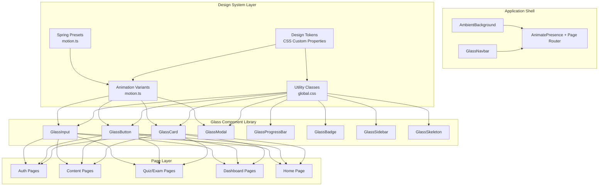
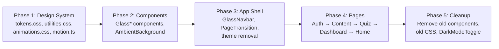

# Design Document: Glassmorphism UI Redesign

## Overview

This design transforms the CSNexus CSE Reviewer frontend from its current flat, light/dark themed UI into a premium Apple-inspired glassmorphism interface using a warm brown gradient palette. The redesign is purely visual — all existing functionality, routing, state management, and API integration remain unchanged.

### Key Design Decisions

1. **No TailwindCSS** — The project uses vanilla CSS custom properties in `global.css` with inline styles in components. The redesign continues this pattern rather than introducing Tailwind, keeping the migration surface minimal.
2. **CSS-first approach** — Glassmorphism effects (backdrop-filter, gradients, shadows) are implemented via CSS custom properties and utility classes. No runtime style computation.
3. **Framer Motion for animations only** — Added as the sole new dependency. Handles physics-based transitions, page animations, and hover/press effects. CSS handles static visual effects.
4. **Component wrapper pattern** — New `Glass*` components wrap existing component interfaces, maintaining backward compatibility. Pages migrate incrementally by swapping imports.
5. **Single theme, no toggle** — The `DarkModeToggle` component and all theme-switching infrastructure are removed. The brown glassmorphism palette is the only visual mode.

### Constraints

- No backend changes
- No new routes or state management
- Must maintain all existing ARIA labels, keyboard navigation, and accessibility patterns
- Must support `@supports` fallback for browsers without `backdrop-filter`
- Must respect `prefers-reduced-motion`

---

## Architecture

### High-Level System Diagram



### Depth Hierarchy (Z-Index System)

```
Layer 0: Ambient Background (z-index: 0, fixed)
Layer 1: Page Content / Glass Surfaces (z-index: 1)
Layer 2: Floating Interactions — tooltips, dropdowns (z-index: 50)
Layer 3: Navbar (z-index: 100, sticky)
Layer 4: Modal Backdrop + Modal Content (z-index: 200)
Layer 5: Toast Notifications (z-index: 9999)
```

---

## Components and Interfaces

### File Structure

```
web/src/
├── design-system/
│   ├── tokens.css              # All CSS custom properties (colors, blur, shadows, spacing)
│   ├── utilities.css           # Utility classes (glass-sm, glass-md, glass-lg, etc.)
│   ├── animations.css          # Keyframe animations (blob movement, shimmer, pulse)
│   ├── motion.ts               # Framer Motion variants, spring presets, hooks
│   └── index.ts                # Re-exports for motion utilities
├── components/
│   ├── AmbientBackground.tsx   # Full-viewport animated gradient layer
│   ├── GlassCard.tsx           # Glass surface container
│   ├── GlassButton.tsx         # Translucent button with spring animations
│   ├── GlassInput.tsx          # Frosted input field
│   ├── GlassModal.tsx          # Centered glass overlay with AnimatePresence
│   ├── GlassNavbar.tsx         # Translucent sticky navbar (replaces Navbar.tsx)
│   ├── GlassSidebar.tsx        # Floating glass navigation panel
│   ├── GlassProgressBar.tsx    # Translucent progress indicator
│   ├── GlassBadge.tsx          # Frosted badge component
│   ├── GlassSkeleton.tsx       # Glass-styled loading skeleton
│   ├── GlassStatCard.tsx       # Glass-styled stat display
│   ├── PageTransition.tsx      # AnimatePresence wrapper for route transitions
│   ├── ... (existing components preserved during migration)
│   ├── Card.tsx                # DEPRECATED — kept for incremental migration
│   ├── Badge.tsx               # DEPRECATED — kept for incremental migration
│   └── ...
├── global.css                  # REPLACED by design-system imports
└── ...
```

### Component Interfaces

#### GlassCard

```typescript
interface GlassCardProps {
  children: React.ReactNode;
  className?: string;
  blur?: "sm" | "md" | "lg";       // backdrop-filter intensity
  hoverable?: boolean;              // enables hover scale + glow
  onClick?: () => void;
  style?: React.CSSProperties;
  as?: "div" | "section" | "article";
}
```

#### GlassButton

```typescript
interface GlassButtonProps {
  children: React.ReactNode;
  variant?: "primary" | "secondary" | "ghost" | "danger";
  size?: "sm" | "md" | "lg";
  disabled?: boolean;
  loading?: boolean;
  onClick?: () => void;
  type?: "button" | "submit" | "reset";
  className?: string;
  style?: React.CSSProperties;
  "aria-label"?: string;
}
```

#### GlassInput

```typescript
interface GlassInputProps extends React.InputHTMLAttributes<HTMLInputElement> {
  label?: string;
  error?: string;
  icon?: React.ReactNode;
}
```

#### GlassModal

```typescript
interface GlassModalProps {
  isOpen: boolean;
  onClose: () => void;
  title?: string;
  children: React.ReactNode;
  size?: "sm" | "md" | "lg";
}
```

#### GlassNavbar

```typescript
// Same behavioral interface as current Navbar
// Internally uses GlassCard-like surface + Framer Motion for mobile drawer
```

#### GlassProgressBar

```typescript
interface GlassProgressBarProps {
  value: number;
  max?: number;
  label?: string;
  animated?: boolean;
  height?: number;
  color?: string;  // defaults to gradient from Brown_Palette
}
```

#### GlassBadge

```typescript
interface GlassBadgeProps {
  label: string;
  color?: "primary" | "success" | "warning" | "danger" | "accent";
  size?: "sm" | "md";
}
```

#### AmbientBackground

```typescript
interface AmbientBackgroundProps {
  blobCount?: number;  // defaults to 5 on desktop, 3 on mobile
}
// Renders as a fixed full-viewport layer at z-index 0
// Pure CSS animations — no JS animation loop
```

#### PageTransition

```typescript
interface PageTransitionProps {
  children: React.ReactNode;
  // Wraps children in motion.div with fadeIn + slideUp variant
}
```

### Animation Utilities (motion.ts)

```typescript
// --- Spring Presets ---
export const springDefault = { type: "spring", stiffness: 300, damping: 20 };
export const springGentle = { type: "spring", stiffness: 200, damping: 25 };
export const springBouncy = { type: "spring", stiffness: 400, damping: 15 };

// --- Animation Variants ---
export const fadeIn = {
  initial: { opacity: 0 },
  animate: { opacity: 1 },
  exit: { opacity: 0 },
  transition: { duration: 0.3 },
};

export const slideUp = {
  initial: { opacity: 0, y: 12 },
  animate: { opacity: 1, y: 0 },
  exit: { opacity: 0, y: -8 },
  transition: springDefault,
};

export const slideDown = {
  initial: { opacity: 0, y: -12 },
  animate: { opacity: 1, y: 0 },
  exit: { opacity: 0, y: 12 },
  transition: springDefault,
};

export const scaleIn = {
  initial: { opacity: 0, scale: 0.95 },
  animate: { opacity: 1, scale: 1 },
  exit: { opacity: 0, scale: 0.95 },
  transition: springGentle,
};

export const staggerContainer = {
  animate: { transition: { staggerChildren: 0.06 } },
};

export const staggerItem = {
  initial: { opacity: 0, y: 8 },
  animate: { opacity: 1, y: 0 },
  transition: springDefault,
};

// --- Hooks ---
export function useReducedMotion(): boolean;
// Returns true if prefers-reduced-motion is set
// When true, all variants return { transition: { duration: 0 } }

export function useMotionVariants(variants: object): object;
// Wraps variants — returns instant transitions when reduced motion is active
```

---

## Data Models

This is a frontend-only redesign. No data models change. The design system introduces no new state management — all visual state is CSS-driven or component-local.

### Design Token Structure (Conceptual)

```typescript
// Not stored as runtime data — compiled into CSS custom properties
interface DesignTokens {
  colors: {
    primary: string;        // Espresso Brown
    secondary: string;      // Mocha
    accent: string;         // Caramel
    surface: string;        // Walnut
    muted: string;          // Sandstone
    highlight: string;      // Champagne Beige
    metallic: string;       // Bronze
    background: string;     // Soft Coffee
    text: string;
    textSecondary: string;
    textMuted: string;
  };
  glass: {
    blur: { sm: string; md: string; lg: string };
    opacity: { subtle: number; medium: number; strong: number };
    border: { light: string; medium: string; strong: string };
  };
  shadows: {
    ambient: string;
    depth: string;
    glow: string;
    diffused: string;
  };
  radii: { sm: string; md: string; lg: string; xl: string; full: string };
  transitions: { fast: string; normal: string; slow: string };
}
```

---


## CSS Architecture (Low-Level Design)

### tokens.css — Design Tokens

```css
/* ===== CSNexus Glassmorphism Design System ===== */

:root {
  /* ── Brown Palette ── */
  --color-primary: #3E2723;          /* Espresso Brown */
  --color-secondary: #5D4037;        /* Mocha */
  --color-accent: #D4A574;           /* Caramel */
  --color-surface: #4E342E;          /* Walnut */
  --color-muted: #A1887F;            /* Sandstone */
  --color-highlight: #F5E6D3;        /* Champagne Beige */
  --color-metallic: #CD7F32;         /* Bronze */
  --color-background: #2C1810;       /* Soft Coffee (deep) */
  --color-background-warm: #1A0F0A;  /* Deepest background */

  /* ── Text Colors ── */
  --color-text: #F5E6D3;             /* Champagne Beige — primary text */
  --color-text-secondary: #A1887F;   /* Sandstone — secondary text */
  --color-text-muted: #795548;       /* Muted brown */

  /* ── Semantic Colors ── */
  --color-success: #81C784;          /* Warm green */
  --color-warning: #FFB74D;          /* Warm amber */
  --color-danger: #E57373;           /* Warm red */
  --color-info: #D4A574;             /* Caramel (reuse accent) */

  /* ── Glass Tokens ── */
  --glass-blur-sm: blur(20px);
  --glass-blur-md: blur(30px);
  --glass-blur-lg: blur(40px);

  --glass-bg-subtle: rgba(78, 52, 46, 0.08);
  --glass-bg-medium: rgba(78, 52, 46, 0.15);
  --glass-bg-strong: rgba(78, 52, 46, 0.25);

  --glass-border-light: rgba(255, 255, 255, 0.05);
  --glass-border-medium: rgba(255, 255, 255, 0.08);
  --glass-border-strong: rgba(255, 255, 255, 0.15);

  /* ── Shadows (warm-tinted) ── */
  --shadow-ambient: 0 0 40px rgba(62, 39, 35, 0.3);
  --shadow-depth: 0 8px 32px rgba(26, 15, 10, 0.4);
  --shadow-glow: 0 0 20px rgba(212, 165, 116, 0.15);
  --shadow-diffused: 0 4px 16px rgba(62, 39, 35, 0.2);
  --shadow-inner: inset 0 1px 2px rgba(0, 0, 0, 0.2);

  /* ── Border Radius ── */
  --radius-sm: 8px;
  --radius-md: 12px;
  --radius-lg: 20px;
  --radius-xl: 28px;
  --radius-full: 9999px;

  /* ── Typography ── */
  --font-family: -apple-system, BlinkMacSystemFont, "SF Pro Display", "SF Pro Text", system-ui, sans-serif;
  --font-size-xs: 0.75rem;
  --font-size-sm: 0.8125rem;
  --font-size-base: 1rem;
  --font-size-lg: 1.125rem;
  --font-size-xl: 1.25rem;
  --font-size-2xl: 1.5rem;
  --font-size-3xl: 2rem;
  --font-size-4xl: 2.75rem;
  --font-size-5xl: 3.5rem;

  /* ── Transitions ── */
  --transition-fast: 150ms ease;
  --transition-normal: 250ms ease;
  --transition-slow: 400ms cubic-bezier(0.4, 0, 0.2, 1);

  /* ── Focus ── */
  --focus-ring: 0 0 0 3px rgba(212, 165, 116, 0.4);

  /* ── Z-Index Scale ── */
  --z-background: 0;
  --z-content: 1;
  --z-floating: 50;
  --z-navbar: 100;
  --z-modal: 200;
  --z-toast: 9999;
}
```

### utilities.css — Utility Classes

```css
/* ── Glass Surfaces ── */
.glass-sm {
  background: var(--glass-bg-subtle);
  backdrop-filter: var(--glass-blur-sm);
  -webkit-backdrop-filter: var(--glass-blur-sm);
  border: 1px solid var(--glass-border-light);
  border-radius: var(--radius-lg);
}

.glass-md {
  background: var(--glass-bg-medium);
  backdrop-filter: var(--glass-blur-md);
  -webkit-backdrop-filter: var(--glass-blur-md);
  border: 1px solid var(--glass-border-medium);
  border-radius: var(--radius-lg);
}

.glass-lg {
  background: var(--glass-bg-strong);
  backdrop-filter: var(--glass-blur-lg);
  -webkit-backdrop-filter: var(--glass-blur-lg);
  border: 1px solid var(--glass-border-strong);
  border-radius: var(--radius-lg);
}

/* ── Top-edge highlight (light reflection simulation) ── */
.glass-sm::before,
.glass-md::before,
.glass-lg::before {
  content: "";
  position: absolute;
  top: 0;
  left: 0;
  right: 0;
  height: 1px;
  background: linear-gradient(90deg, transparent, rgba(255, 255, 255, 0.1), transparent);
  border-radius: var(--radius-lg) var(--radius-lg) 0 0;
  pointer-events: none;
}

/* ── Gradient Backgrounds ── */
.gradient-primary {
  background: linear-gradient(135deg, var(--color-primary), var(--color-secondary));
}

.gradient-accent {
  background: linear-gradient(135deg, var(--color-accent), var(--color-metallic));
}

.gradient-warm {
  background: linear-gradient(135deg, var(--color-background), var(--color-surface));
}

/* ── Glass Buttons ── */
.btn-glass {
  background: var(--glass-bg-medium);
  backdrop-filter: var(--glass-blur-sm);
  -webkit-backdrop-filter: var(--glass-blur-sm);
  border: 1px solid var(--glass-border-medium);
  color: var(--color-text);
  border-radius: var(--radius-md);
  padding: 0.625rem 1.25rem;
  font-weight: 500;
  cursor: pointer;
  transition: box-shadow var(--transition-fast), background var(--transition-fast);
}

.btn-glass:hover {
  box-shadow: var(--shadow-glow);
  background: var(--glass-bg-strong);
}

.btn-glass-primary {
  background: linear-gradient(135deg, var(--color-accent), var(--color-metallic));
  border: 1px solid rgba(212, 165, 116, 0.3);
  color: var(--color-background-warm);
  font-weight: 600;
}

.btn-glass-primary:hover {
  box-shadow: 0 0 24px rgba(212, 165, 116, 0.25);
}

/* ── @supports fallback ── */
@supports not (backdrop-filter: blur(10px)) {
  .glass-sm,
  .glass-md,
  .glass-lg {
    background: rgba(78, 52, 46, 0.85);
  }
}

/* ── Reduced Motion ── */
@media (prefers-reduced-motion: reduce) {
  *,
  *::before,
  *::after {
    animation-duration: 0.01ms !important;
    animation-iteration-count: 1 !important;
    transition-duration: 0.01ms !important;
    scroll-behavior: auto !important;
  }
}

/* ── Responsive Glass Adjustments ── */
@media (max-width: 640px) {
  .glass-sm,
  .glass-md,
  .glass-lg {
    backdrop-filter: blur(15px);
    -webkit-backdrop-filter: blur(15px);
  }

  .glass-sm { background: rgba(78, 52, 46, 0.12); }
  .glass-md { background: rgba(78, 52, 46, 0.20); }
  .glass-lg { background: rgba(78, 52, 46, 0.30); }
}
```

### animations.css — Keyframe Animations

```css
/* ── Ambient Background Blob Movement ── */
@keyframes blob-drift-1 {
  0%, 100% { transform: translate(0, 0) scale(1); }
  25% { transform: translate(80px, -60px) scale(1.1); }
  50% { transform: translate(-40px, 80px) scale(0.95); }
  75% { transform: translate(60px, 40px) scale(1.05); }
}

@keyframes blob-drift-2 {
  0%, 100% { transform: translate(0, 0) scale(1); }
  33% { transform: translate(-100px, 50px) scale(1.08); }
  66% { transform: translate(70px, -80px) scale(0.92); }
}

@keyframes blob-drift-3 {
  0%, 100% { transform: translate(0, 0) scale(1.05); }
  50% { transform: translate(90px, 70px) scale(0.9); }
}

/* ── Glass Shimmer (skeleton loading) ── */
@keyframes glass-shimmer {
  0% { background-position: -200% 0; }
  100% { background-position: 200% 0; }
}

/* ── Subtle Pulse (timer warning) ── */
@keyframes gentle-pulse {
  0%, 100% { opacity: 1; }
  50% { opacity: 0.7; }
}

/* ── Grain Noise Overlay ── */
@keyframes grain-shift {
  0%, 100% { transform: translate(0, 0); }
  10% { transform: translate(-1%, -1%); }
  20% { transform: translate(1%, 0%); }
  30% { transform: translate(0%, 1%); }
  40% { transform: translate(-1%, 1%); }
  50% { transform: translate(1%, -1%); }
  60% { transform: translate(0%, 0%); }
  70% { transform: translate(-1%, 0%); }
  80% { transform: translate(1%, 1%); }
  90% { transform: translate(0%, -1%); }
}
```

---

## Ambient Background Implementation

### Architecture

The `AmbientBackground` component renders as a fixed full-viewport layer behind all content. It uses **CSS-only animations** — no JavaScript animation loops, no `requestAnimationFrame`.

### Implementation Approach

```tsx
// AmbientBackground.tsx — Conceptual structure
export function AmbientBackground() {
  return (
    <div className="ambient-bg" aria-hidden="true">
      {/* Gradient blobs — CSS animated */}
      <div className="ambient-blob ambient-blob-1" />
      <div className="ambient-blob ambient-blob-2" />
      <div className="ambient-blob ambient-blob-3" />
      <div className="ambient-blob ambient-blob-4" />
      <div className="ambient-blob ambient-blob-5" />

      {/* Noise texture overlay */}
      <div className="ambient-noise" />

      {/* Depth gradient overlay */}
      <div className="ambient-depth" />
    </div>
  );
}
```

### CSS for Ambient Background

```css
.ambient-bg {
  position: fixed;
  inset: 0;
  z-index: var(--z-background);
  overflow: hidden;
  background: var(--color-background-warm);
  pointer-events: none;
}

.ambient-blob {
  position: absolute;
  border-radius: 50%;
  filter: blur(80px);
  opacity: 0.4;
  will-change: transform;
}

.ambient-blob-1 {
  width: 600px;
  height: 600px;
  top: -10%;
  left: -5%;
  background: radial-gradient(circle, var(--color-primary), transparent 70%);
  animation: blob-drift-1 12s ease-in-out infinite;
}

.ambient-blob-2 {
  width: 500px;
  height: 500px;
  top: 40%;
  right: -10%;
  background: radial-gradient(circle, var(--color-secondary), transparent 70%);
  animation: blob-drift-2 15s ease-in-out infinite;
}

.ambient-blob-3 {
  width: 450px;
  height: 450px;
  bottom: -5%;
  left: 30%;
  background: radial-gradient(circle, var(--color-accent), transparent 70%);
  animation: blob-drift-3 10s ease-in-out infinite;
}

.ambient-blob-4 {
  width: 350px;
  height: 350px;
  top: 20%;
  left: 50%;
  background: radial-gradient(circle, var(--color-metallic), transparent 70%);
  animation: blob-drift-1 14s ease-in-out infinite reverse;
}

.ambient-blob-5 {
  width: 400px;
  height: 400px;
  bottom: 20%;
  right: 20%;
  background: radial-gradient(circle, var(--color-surface), transparent 70%);
  animation: blob-drift-2 11s ease-in-out infinite reverse;
}

/* Noise texture */
.ambient-noise {
  position: absolute;
  inset: 0;
  opacity: 0.03;
  background-image: url("data:image/svg+xml,%3Csvg viewBox='0 0 256 256' xmlns='http://www.w3.org/2000/svg'%3E%3Cfilter id='noise'%3E%3CfeTurbulence type='fractalNoise' baseFrequency='0.65' numOctaves='3' stitchTiles='stitch'/%3E%3C/filter%3E%3Crect width='100%25' height='100%25' filter='url(%23noise)'/%3E%3C/svg%3E");
  background-repeat: repeat;
  background-size: 256px 256px;
  animation: grain-shift 8s steps(10) infinite;
  pointer-events: none;
}

/* Depth overlay — vignette effect */
.ambient-depth {
  position: absolute;
  inset: 0;
  background: radial-gradient(ellipse at center, transparent 40%, rgba(26, 15, 10, 0.5) 100%);
  pointer-events: none;
}

/* Mobile: reduce blob count via CSS */
@media (max-width: 640px) {
  .ambient-blob-4,
  .ambient-blob-5 {
    display: none;
  }
  .ambient-blob {
    filter: blur(60px);
    opacity: 0.3;
  }
}

/* Reduced motion: static gradient */
@media (prefers-reduced-motion: reduce) {
  .ambient-blob {
    animation: none !important;
  }
  .ambient-noise {
    animation: none !important;
  }
}
```

### Persistence Across Routes

The `AmbientBackground` is rendered **once** in `App.tsx` outside the `<Routes>` component, ensuring it never re-mounts during navigation:

```tsx
// App.tsx structure
<BrowserRouter>
  <ToastProvider>
    <AmbientBackground />
    <GlassNavbar />
    <AnimatePresence mode="wait">
      <Routes location={location} key={location.pathname}>
        {/* ... routes ... */}
      </Routes>
    </AnimatePresence>
  </ToastProvider>
</BrowserRouter>
```

---


## Component Implementation Details

### GlassCard — Detailed Implementation

```tsx
import { motion } from "framer-motion";
import { useReducedMotion } from "../design-system";

interface GlassCardProps {
  children: React.ReactNode;
  className?: string;
  blur?: "sm" | "md" | "lg";
  hoverable?: boolean;
  onClick?: () => void;
  style?: React.CSSProperties;
  as?: "div" | "section" | "article";
}

export function GlassCard({
  children,
  className = "",
  blur = "md",
  hoverable = false,
  onClick,
  style,
  as = "div",
}: GlassCardProps) {
  const reducedMotion = useReducedMotion();
  const Component = motion[as];

  const hoverAnimation = hoverable && !reducedMotion
    ? { scale: 1.01, boxShadow: "var(--shadow-glow)" }
    : {};

  const tapAnimation = hoverable && !reducedMotion
    ? { scale: 0.99 }
    : {};

  return (
    <Component
      className={`glass-${blur} glass-card ${className}`}
      style={{ position: "relative", padding: "1.5rem", ...style }}
      whileHover={hoverAnimation}
      whileTap={onClick ? tapAnimation : undefined}
      onClick={onClick}
      role={onClick ? "button" : undefined}
      tabIndex={onClick ? 0 : undefined}
      onKeyDown={onClick ? (e) => { if (e.key === "Enter" || e.key === " ") onClick(); } : undefined}
      transition={{ type: "spring", stiffness: 300, damping: 20 }}
    >
      {children}
    </Component>
  );
}
```

### GlassButton — Detailed Implementation

```tsx
import { motion } from "framer-motion";
import { springDefault } from "../design-system";

interface GlassButtonProps {
  children: React.ReactNode;
  variant?: "primary" | "secondary" | "ghost" | "danger";
  size?: "sm" | "md" | "lg";
  disabled?: boolean;
  loading?: boolean;
  onClick?: () => void;
  type?: "button" | "submit" | "reset";
  className?: string;
  style?: React.CSSProperties;
  "aria-label"?: string;
}

export function GlassButton({
  children,
  variant = "primary",
  size = "md",
  disabled = false,
  loading = false,
  onClick,
  type = "button",
  className = "",
  style,
  ...rest
}: GlassButtonProps) {
  const sizeClasses = {
    sm: "btn-sm",
    md: "btn-md",
    lg: "btn-lg",
  };

  return (
    <motion.button
      className={`btn-glass btn-glass-${variant} ${sizeClasses[size]} ${className}`}
      style={style}
      onClick={onClick}
      type={type}
      disabled={disabled || loading}
      whileHover={!disabled ? { scale: 1.02 } : undefined}
      whileTap={!disabled ? { scale: 0.97 } : undefined}
      transition={springDefault}
      {...rest}
    >
      {loading ? <span className="btn-spinner" aria-hidden="true" /> : children}
    </motion.button>
  );
}
```

### GlassInput — Detailed Implementation

```tsx
import { forwardRef } from "react";

interface GlassInputProps extends React.InputHTMLAttributes<HTMLInputElement> {
  label?: string;
  error?: string;
  icon?: React.ReactNode;
}

export const GlassInput = forwardRef<HTMLInputElement, GlassInputProps>(
  ({ label, error, icon, className = "", id, ...props }, ref) => {
    const inputId = id || `input-${label?.toLowerCase().replace(/\s+/g, "-")}`;

    return (
      <div className="glass-input-group">
        {label && (
          <label htmlFor={inputId} className="glass-input-label">
            {label}
          </label>
        )}
        <div className="glass-input-wrapper">
          {icon && <span className="glass-input-icon" aria-hidden="true">{icon}</span>}
          <input
            ref={ref}
            id={inputId}
            className={`glass-input ${error ? "glass-input-error" : ""} ${className}`}
            aria-invalid={!!error}
            aria-describedby={error ? `${inputId}-error` : undefined}
            {...props}
          />
        </div>
        {error && (
          <p id={`${inputId}-error`} className="glass-input-error-text" role="alert" aria-live="polite">
            {error}
          </p>
        )}
      </div>
    );
  }
);
```

### GlassInput CSS

```css
.glass-input-group {
  margin-bottom: 1.25rem;
}

.glass-input-label {
  display: block;
  margin-bottom: 0.375rem;
  font-size: var(--font-size-sm);
  font-weight: 500;
  color: var(--color-text-secondary);
}

.glass-input-wrapper {
  position: relative;
}

.glass-input {
  width: 100%;
  padding: 0.75rem 1rem;
  background: var(--glass-bg-subtle);
  backdrop-filter: var(--glass-blur-sm);
  -webkit-backdrop-filter: var(--glass-blur-sm);
  border: 1px solid var(--glass-border-medium);
  border-radius: var(--radius-md);
  font-size: var(--font-size-base);
  font-family: var(--font-family);
  color: var(--color-text);
  box-shadow: var(--shadow-inner);
  transition: border-color var(--transition-fast), box-shadow var(--transition-fast);
}

.glass-input::placeholder {
  color: var(--color-text-muted);
}

.glass-input:focus {
  outline: none;
  border-color: var(--color-accent);
  box-shadow: var(--focus-ring), var(--shadow-inner);
}

.glass-input-error {
  border-color: var(--color-danger);
}

.glass-input-error-text {
  margin-top: 0.25rem;
  font-size: var(--font-size-xs);
  color: var(--color-danger);
}

.glass-input-icon {
  position: absolute;
  left: 0.875rem;
  top: 50%;
  transform: translateY(-50%);
  color: var(--color-text-muted);
}

.glass-input-wrapper:has(.glass-input-icon) .glass-input {
  padding-left: 2.5rem;
}
```

### GlassNavbar — Scroll Behavior

```tsx
import { useState, useEffect } from "react";
import { Link, useLocation } from "react-router-dom";
import { motion, AnimatePresence } from "framer-motion";
import { isAuthenticated } from "../stores/auth";
import { slideDown, springDefault } from "../design-system";

export function GlassNavbar() {
  const location = useLocation();
  const [menuOpen, setMenuOpen] = useState(false);
  const [scrolled, setScrolled] = useState(false);

  useEffect(() => {
    function handleScroll() {
      setScrolled(window.scrollY > 10);
    }
    window.addEventListener("scroll", handleScroll, { passive: true });
    return () => window.removeEventListener("scroll", handleScroll);
  }, []);

  useEffect(() => { setMenuOpen(false); }, [location.pathname]);

  return (
    <header
      className="glass-navbar"
      style={{
        background: scrolled
          ? "var(--glass-bg-medium)"
          : "transparent",
        backdropFilter: scrolled ? "var(--glass-blur-md)" : "none",
        WebkitBackdropFilter: scrolled ? "var(--glass-blur-md)" : "none",
        borderBottom: scrolled
          ? "1px solid var(--glass-border-light)"
          : "1px solid transparent",
      }}
    >
      {/* ... nav content same structure as current Navbar ... */}
      {/* Mobile drawer uses AnimatePresence + motion.nav with slideDown variant */}
      <AnimatePresence>
        {menuOpen && (
          <motion.nav
            className="glass-md glass-mobile-drawer"
            {...slideDown}
            transition={springDefault}
          >
            {/* nav links */}
          </motion.nav>
        )}
      </AnimatePresence>
    </header>
  );
}
```

### GlassNavbar CSS

```css
.glass-navbar {
  position: sticky;
  top: 0;
  z-index: var(--z-navbar);
  display: flex;
  justify-content: space-between;
  align-items: center;
  padding: 0.75rem 1.25rem;
  transition: background var(--transition-normal),
              backdrop-filter var(--transition-normal),
              border-color var(--transition-normal);
}

.glass-navbar-link {
  padding: 0.5rem 0.875rem;
  border-radius: var(--radius-sm);
  font-size: var(--font-size-sm);
  font-weight: 500;
  color: var(--color-text-secondary);
  text-decoration: none;
  transition: background var(--transition-fast), color var(--transition-fast);
}

.glass-navbar-link:hover {
  background: var(--glass-bg-subtle);
  color: var(--color-text);
}

.glass-navbar-link.active {
  background: var(--glass-bg-medium);
  color: var(--color-accent);
}

.glass-mobile-drawer {
  position: absolute;
  top: 100%;
  left: 0;
  right: 0;
  padding: 0.5rem 1rem;
  box-shadow: var(--shadow-depth);
}
```

### PageTransition Wrapper

```tsx
import { motion } from "framer-motion";
import { slideUp, useReducedMotion } from "../design-system";

interface PageTransitionProps {
  children: React.ReactNode;
}

export function PageTransition({ children }: PageTransitionProps) {
  const reducedMotion = useReducedMotion();

  if (reducedMotion) {
    return <>{children}</>;
  }

  return (
    <motion.div
      initial={slideUp.initial}
      animate={slideUp.animate}
      exit={slideUp.exit}
      transition={slideUp.transition}
    >
      {children}
    </motion.div>
  );
}
```

---

## Performance Strategy

### GPU Acceleration

| Technique | Application |
|-----------|-------------|
| `will-change: transform` | Ambient blobs, hoverable cards |
| `transform: translateZ(0)` | Force GPU layer for glass surfaces with animations |
| CSS-only blob animations | No JS animation loop — pure `@keyframes` |
| `contain: layout style paint` | Applied to glass cards to limit repaint scope |

### Lazy Rendering

Glass surfaces below the fold use an `IntersectionObserver`-based approach:

```tsx
// useInView hook (lightweight, no library needed)
function useInView(ref: React.RefObject<Element>, options?: IntersectionObserverInit) {
  const [inView, setInView] = useState(false);
  useEffect(() => {
    if (!ref.current) return;
    const observer = new IntersectionObserver(([entry]) => {
      if (entry.isIntersecting) {
        setInView(true);
        observer.disconnect(); // Only trigger once
      }
    }, { rootMargin: "100px", ...options });
    observer.observe(ref.current);
    return () => observer.disconnect();
  }, []);
  return inView;
}
```

Cards in grid layouts (ModuleList, Home features) render with `opacity: 0` until in view, then animate in via Framer Motion's `staggerItem` variant.

### Backdrop-Filter Optimization

- Only visible elements get `backdrop-filter`. Off-screen elements use solid fallback.
- On mobile (<640px), blur is reduced from 20-40px to 15px to reduce GPU load.
- The `@supports` fallback ensures non-supporting browsers get solid semi-transparent backgrounds.

### Performance Budget

| Metric | Target |
|--------|--------|
| Lighthouse Performance (Desktop) | > 80 |
| Lighthouse Performance (Mobile) | > 70 |
| First Contentful Paint | < 1.5s |
| Largest Contentful Paint | < 2.5s |
| Total Blocking Time | < 200ms |
| Cumulative Layout Shift | < 0.1 |

### Bundle Impact

- `framer-motion` adds ~30KB gzipped. This is the only new dependency.
- CSS files (tokens + utilities + animations) add ~5KB total.
- No new runtime state management or data fetching libraries.

---

## Migration Strategy

### Phase Approach

The migration follows a bottom-up approach — design system first, then components, then pages:



### Import Swap Pattern

Pages migrate by swapping imports. Old and new components coexist during migration:

```tsx
// Before
import { Card } from "../components/Card";
import { Badge } from "../components/Badge";

// After
import { GlassCard } from "../components/GlassCard";
import { GlassBadge } from "../components/GlassBadge";
```

The `GlassCard` accepts the same `hoverable`, `onClick`, `className`, and `children` props as `Card`, so page-level code changes are minimal (mostly import path changes).

### global.css Replacement

The current `global.css` is replaced by importing the design system files:

```css
/* New global.css */
@import "./design-system/tokens.css";
@import "./design-system/utilities.css";
@import "./design-system/animations.css";

/* Reset and base styles remain inline */
*, *::before, *::after { box-sizing: border-box; }
html { font-size: 16px; scroll-behavior: smooth; }
body {
  margin: 0;
  font-family: var(--font-family);
  background-color: var(--color-background-warm);
  color: var(--color-text);
  line-height: 1.6;
  -webkit-font-smoothing: antialiased;
  -moz-osx-font-smoothing: grayscale;
}
```

### Theme Removal Checklist

1. Delete `web/src/components/DarkModeToggle.tsx`
2. Remove `import { DarkModeToggle }` from `Navbar.tsx` (or `GlassNavbar.tsx`)
3. Remove `[data-theme="dark"]` block from CSS
4. Remove `document.documentElement.setAttribute("data-theme", ...)` calls
5. Remove `localStorage.getItem/setItem("cse_theme")` logic
6. Remove `prefers-color-scheme` media query for theme detection
7. Remove `<DarkModeToggle />` JSX from navbar

---

## Error Handling

### Visual Error States

Error states within glass components use warm-tinted red-brown colors rather than harsh red:

```css
.glass-error {
  border-color: var(--color-danger);
  box-shadow: 0 0 12px rgba(229, 115, 115, 0.15);
}

.glass-error-text {
  color: var(--color-danger);
  font-size: var(--font-size-xs);
  margin-top: 0.25rem;
}
```

### Fallback Behavior

| Scenario | Fallback |
|----------|----------|
| No `backdrop-filter` support | Solid semi-transparent background via `@supports` |
| No CSS custom properties | Not supported — modern browsers only (React 18 requirement already gates this) |
| Framer Motion fails to load | Components render without animation (static glass surfaces still work) |
| Ambient background performance issue | Reduced blob count on mobile; `prefers-reduced-motion` disables all animation |

### Loading States

All loading states use `GlassSkeleton` — a glass-styled shimmer animation:

```css
.glass-skeleton {
  background: linear-gradient(
    90deg,
    var(--glass-bg-subtle) 25%,
    var(--glass-bg-medium) 50%,
    var(--glass-bg-subtle) 75%
  );
  background-size: 200% 100%;
  animation: glass-shimmer 1.5s infinite;
  border-radius: var(--radius-md);
}
```

---

## Testing Strategy

### Visual Testing Approach

Since this is a UI/UX redesign, correctness is verified through visual inspection and automated metrics rather than property-based testing.

| Test Type | What It Verifies | Tool |
|-----------|-----------------|------|
| Visual Regression | Component appearance matches design | Manual review / screenshot comparison |
| Lighthouse Audit | Performance score > 80 desktop, > 70 mobile | Lighthouse CI |
| Accessibility Audit | WCAG 2.1 AA compliance, contrast ratios | axe-core, Lighthouse |
| Contrast Verification | 4.5:1 body text, 3:1 large text against glass surfaces | Chrome DevTools contrast checker |
| Responsive Testing | Layout integrity across breakpoints | Browser DevTools, real devices |
| Reduced Motion | Animations disabled when preference set | Manual toggle + visual check |
| @supports Fallback | Solid backgrounds on non-supporting browsers | Firefox/Safari testing |
| Keyboard Navigation | Focus rings visible, tab order preserved | Manual keyboard walkthrough |

### Unit Tests (Existing)

Existing component tests (if any) continue to pass since:
- Component interfaces are backward-compatible
- No behavioral logic changes
- Only visual presentation changes

### Integration Verification

- All existing API calls continue to work (no data layer changes)
- All routes remain accessible
- All form submissions work identically
- All ARIA labels and roles preserved

### Smoke Tests

After migration, verify:
1. Every page loads without console errors
2. Navigation between all routes works
3. Auth flow (login → protected page → logout) works
4. Quiz/exam timer functions correctly
5. Leaderboard data displays
6. Profile page shows XP/achievements

---

## Accessibility Strategy

### Contrast Compliance

The brown palette on glass surfaces must meet WCAG 2.1 AA:

| Element | Foreground | Background (composited) | Ratio | Requirement |
|---------|-----------|------------------------|-------|-------------|
| Body text | `#F5E6D3` | `~#3A2520` (glass over ambient) | ~7.2:1 | ≥ 4.5:1 ✓ |
| Secondary text | `#A1887F` | `~#3A2520` | ~3.8:1 | ≥ 3:1 (large) ✓ |
| Accent on glass | `#D4A574` | `~#3A2520` | ~4.6:1 | ≥ 4.5:1 ✓ |
| Button text (primary) | `#1A0F0A` | `#D4A574` gradient | ~8.1:1 | ≥ 4.5:1 ✓ |

*Note: Actual composited backgrounds depend on ambient blob positions. The glass opacity values are tuned to guarantee minimum contrast regardless of blob position.*

### Focus Management

```css
/* Warm-tinted focus ring — visible on all glass surfaces */
:focus-visible {
  outline: none;
  box-shadow: 0 0 0 3px rgba(212, 165, 116, 0.5),
              0 0 0 6px rgba(212, 165, 116, 0.2);
  border-radius: var(--radius-sm);
}

/* High contrast mode support */
@media (forced-colors: active) {
  .glass-sm, .glass-md, .glass-lg {
    border: 2px solid CanvasText;
  }
}
```

### Reduced Motion

- All Framer Motion animations check `useReducedMotion()` hook
- CSS animations use `@media (prefers-reduced-motion: reduce)` to disable
- Ambient background shows static gradient (no blob movement)
- Page transitions are instant (no slide/fade)

### Screen Reader Considerations

- `AmbientBackground` has `aria-hidden="true"` — purely decorative
- All existing ARIA labels, roles, and `aria-live` regions preserved
- Glass visual effects don't affect DOM structure or reading order
- Focus order follows visual layout (no z-index traps)

### Typography Accessibility

- All sizes use `rem` units — respects browser font size settings
- Line height 1.6 for body, 1.3 for headings
- Maximum content width for readability (65ch for lesson content)
- No text over complex animated backgrounds (text always on glass surface)
